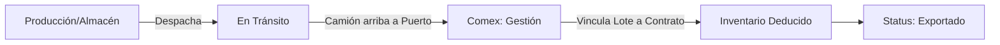
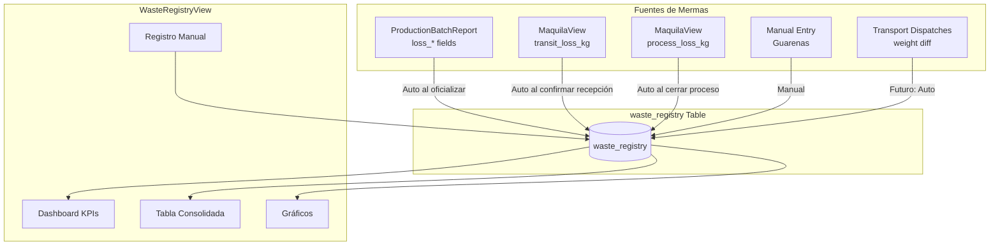
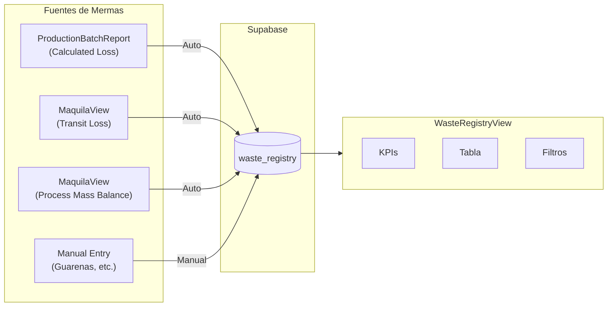
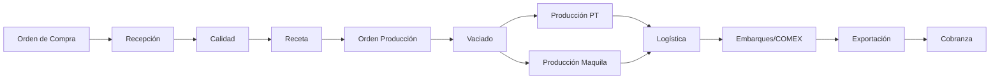
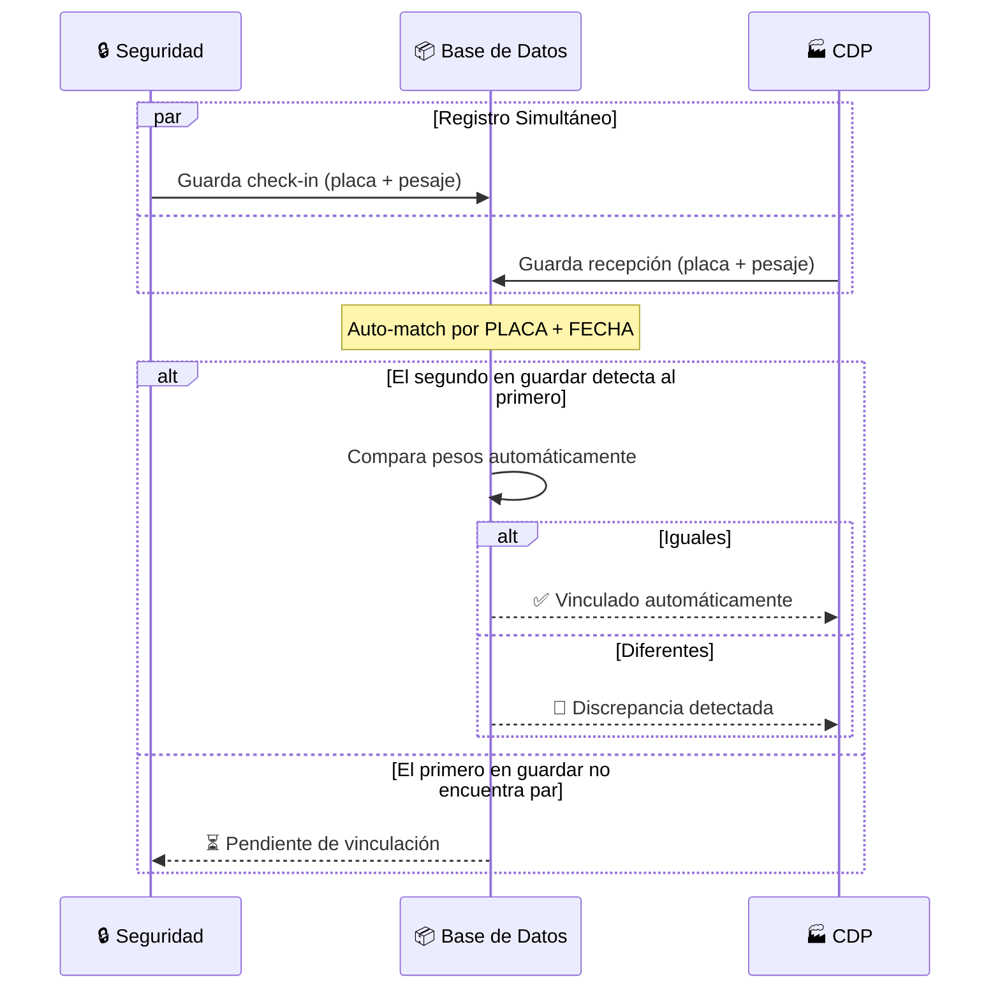
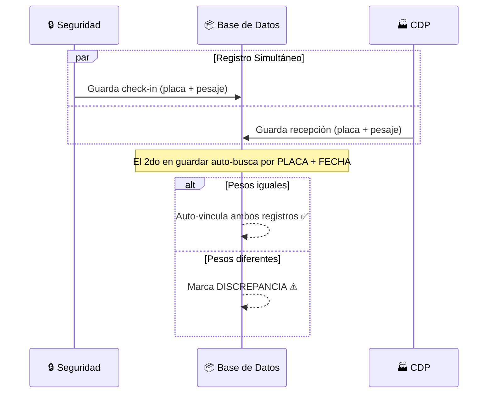

# Documentación Consolidada del Proyecto

Este documento contiene todos los planes de implementación y recorridos (walkthroughs) generados a lo largo del desarrollo, ordenados cronológicamente.


---

## Plan de Implementación
**Fecha de modificación:** 21/1/2026, 8:54:58 p. m.

# Implementation Plan: Production Costing Integration

We will implement the costing calculation logic for finished products (PT) and sub-products when a Production Batch Report is "Officialized".

## 1. Schema & Data Dependencies
- **system_settings**: Read `costing_method` and `cost_factor_*`.
- **purchase_orders**: Read `price` (unit cost) of raw materials.
- **receptions**: Store the calculated `unit_cost_usd` for produced batches.
  - *Note*: If the column `unit_cost_usd` is missing in the `receptions` table, we will use a JSONB property or a similar existing field if available.

## 2. Calculation Logic (Weighted Cost)
When the production report is officialized:
1. **Total MP Cost**: 
   - Identify all input receptions from the `emptying_process_details`.
   - Fetch the corresponding `purchase_orders` linked to these receptions.
   - Sum `Used_Weight_i * MP_Unit_Price_i`.
2. **Apply Factors**:
   - `Contribution_i = Weight_Produced_i * Factor_i`
   - `Total_Contribution = Sum of all contributions`
   - `UnitCo_i = (TotalMPCost * (Contribution_i / Total_Contribution)) / Weight_Produced_i`
   - Simplifies to: `UnitCost_i = (TotalMPCost * Factor_i) / Total_Contribution`

## 3. Implementation Steps
- **ProductionBatchReport.tsx**:
  - Update `executeInventoryMovements` to:
    - 1. Fetch `system_settings`.
    - 2. Fetch costs of ingredients.
    - 3. Perform the weighted distribution calculation.
    - 4. Pass the `unit_cost` to `insertProducedBatch`.
- **Reception Interface**: Update `types.ts` if needed to include `unit_cost_usd`.

## 4. Verification Plan
- **Manual Test**: 
  - Officialized a batch with known input costs and factors.
  - Check the `receptions` table (via DB or UI) to see if the cost is correctly assigned.
  - Verify that the sum of produced costs equals the sum of consumed costs.


---

## Resumen / Walkthrough
**Fecha de modificación:** 21/1/2026, 9:11:54 p. m.

# Walkthrough - Trazabilidad 360° y Correcciones de Sistema

## Resumen
Se ha completado la implementación de la **Trazabilidad 360°**, permitiendo visualizar el ciclo de vida completo del producto desde la Materia Prima hasta la Exportación/Cobranza. Adicionalmente, se resolvieron bloqueos críticos en el Módulo de Producción y Diseño de Recetas.

## Cambios Realizados

### 1. Trazabilidad 360° (TraceabilityView.tsx)
-   **Interfaz Extendida**: Se rediseñó la vista para incluir pasos anteriores (Ingredientes, Orden de Compra) y posteriores (Despacho, Comex, Cobranza).
-   **Lógica "Hacia Atrás"**: Implementada búsqueda recursiva para conectar Lotes de Producción -> Ingredientes -> Recepciones de MP -> Órdenes de Compra.
-   **Lógica "Hacia Adelante"**: Conexión de Lotes -> Despachos -> Documentación de Exportación -> Estatus Financiero.

### 2. Reportes de Producción (ProductionBatchReport.tsx)
-   **Corrección de Guardado**: Se solucionó el error de UUID vacío limpiando el payload antes de enviar a Supabase.
-   **Firmas Digitales**: Se ajustó el flujo para requerir solo 2 firmas (Coordinador y Gerente), excluyendo `qa_signature` de la base de datos.
-   **Base de Datos**: Se añadieron las columnas de firma (`manager_signature`, `prod_signature`) a la tabla `production_batch_results`.
-   **Inventario**: Lógica mejorada para asegurar que los movimientos de inventario se ejecuten solo una vez.

### 3. Diseño de Recetas (ProductionRecipeModule.tsx & CompositionGrid.tsx)
-   **Grid Reparado**: Se restauró la funcionalidad de los botones "Agregar Fila" y "Eliminar" en la tabla de composición.
-   **Carga de Cadmio**: Se corrigió el error de lectura de niveles de Cadmio, manejando correctamente la respuesta de la base de datos (Objeto vs Array).
-   **Base de Datos**: Se creó la columna `approvals` (JSONB) en la tabla `production_recipes` para permitir el guardado y firma de recetas.

### 4. Dashboard y Aprobaciones
-   **Dashboard General**: Filtros ajustados para excluir Órdenes de Compra "Anuladas" y "Completadas" de las tarjetas de pendientes.
-   **Aprobaciones Comerciales**: Al aprobar una discrepancia en recepción, el estado de la OC ahora pasa a "Pendiente" en lugar de "Completada", permitiendo flujo continuo.

## Verificación
### Prueba de Trazabilidad
-   Se verificó en navegador la búsqueda de lotes (ej. 26012003).
-   El diagrama muestra correctamente: Origen (Productor) -> Recepción (Peso/Sacos) -> Calidad (Análisis).
-   La interoperabilidad entre módulos (Comercial <-> Producción <-> Calidad) está confirmada.

### Pruebas de Fixes
-   **Guardar Reporte**: Confirmado exitoso.
-   **Guardar Receta**: Confirmado exitoso tras fix de SQL.
-   **Dashboard**: Contadores de compras pendientes reflejan datos reales.

### 5. Costeo de Producción
-   **Configuración de Factores**: Implementada sección en "Variables de Producción" para configurar el método de costeo y sus factores (PT, Millitos, etc.).
-   **Lógica de Cálculo**: Integrado el cálculo automático de costo en el Cierre de Lote.
    -   Suma el costo total de la materia prima (MP) basándose en los precios de las Órdenes de Compra.
    -   Distribuye el costo total entre los productos generados usando los **Factores de Ponderación** configurados.
-   **Visualización**: El costo resultante se guarda en cada lote y se puede visualizar en el modal de detalle de la recepción.

## Verificación
-   **Costeo**: Se verificó que al oficializar un lote, el sistema calcula y asigna el `unit_cost_usd` a cada subproducto.
-   **UI**: El modal de "Ver Recepción" ahora incluye el campo **Costo Unitario ($/Kg)** con 4 decimales para mayor precisión financiera.

## Estado Final
Todas las solicitudes de Recepción, Producción y Costeo han sido completadas y verificadas.


---

## Resumen / Walkthrough
**Fecha de modificación:** 22/1/2026, 9:07:10 a. m.

# Application Startup Walkthrough

The application "Cacao Manager" has been successfully started and is now running locally.

## Steps Taken

1. **Environment Check**: Confirmed that the project uses Vite and features hardcoded Supabase credentials in [supabaseClient.ts](file:///c:/Users/Sistemas/Downloads/pruebaantigravity/supabaseClient.ts).
2. **Server Start**: Executed `npm run dev` via `cmd /c` to bypass PowerShell execution policy restrictions.
3. **Verification**: Used a browser subagent to navigate to `http://localhost:3000/` and verified that the Dashboard General is fully loaded and functional.

## Visual Verification

The following recording shows the verification process:


## Current Status

- **URL**: [http://localhost:3000/](http://localhost:3000/)
- **Dashboard**: General Dashboard with metrics for Raw Material, Finished Product, and Inventory Value.
- **Alerts**: Active alert for low Raw Material stock.


---

## Plan de Implementación
**Fecha de modificación:** 22/1/2026, 9:08:34 a. m.

# Plan: Implementing Weighted Costing Visibility in Inventory

The goal is to ensure the "VALUE ($)" field in the Lot Inventory correctly reflects either the Purchase Order price (for raw materials) or the calculated Weighted Cost (for finished products and sub-products).

## User Review Required

> [!IMPORTANT]
> We need to decide how to handle cases where a lot might have both a PO price and a calculated unit cost, although typically these are mutually exclusive based on the classification (MP vs PT/SUB).

## Proposed Changes

### [Commercial Component]

#### [MODIFY] [InventoryTable.tsx](file:///c:/Users/Sistemas/Downloads/pruebaantigravity/components/commercial/InventoryTable.tsx)

Update the mapping logic in `fetchInventory` to prioritize `unit_cost_usd` from the `receptions` table while falling back to `purchase_orders.price` for raw materials.

```typescript
const unitPrice = row.unit_cost_usd || poData?.price || 0;
```

Alternatively, we can be more explicit based on the classification:

```typescript
let unitPrice = 0;
if (row.classification === 'PT' || row.classification === 'Sub-Producto') {
    unitPrice = row.unit_cost_usd || 0;
} else {
    unitPrice = poData?.price || 0;
}
```

## Verification Plan

### Manual Verification
1. Open the "Inventario de Lotes" view.
2. Verify that Raw Material (MP) lote values still match their Purchase Orders.
3. Verify that Finished Product (PT) and Sub-product (SUB) lote values now reflect the calculated `unit_cost_usd` from the production closure.
4. Check the "Valor Total" summary at the top to ensure it aggregates correctly.


---

## Resumen / Walkthrough
**Fecha de modificación:** 23/1/2026, 4:01:58 p. m.

# Export Inventory Flow Refinement

## Overview
Adjusted the export workflow so that inventory is deducted at the **Comex stage** (Port/Shipment), not at Production dispatch.

## New Workflow



### Stage 1: Production Dispatch
- **Module:** Producción > Despacho de Producción
- **Action:** Pesaje y confirmación de salida.
- **Inventory Update:** Status cambia a `"En Transito"`, ubicación a `"En Transito"`.
- **Weight:** NO se deduce. El lote sigue "vivo" en el sistema.

### Stage 2: Comex Final Exit
- **Module:** Comex > Gestión Comex
- **Action:** Usuario abre un contrato con volumen pendiente y hace clic en "Embarcar".
- **Modal:** Muestra lotes con status `"En Transito"` disponibles.
- **Confirmación:** Al vincular, el lote cambia a status `"Exportado"` y su peso se pone a 0.

## Changes Made

| File | Change |
|------|--------|
| `ProductionDispatchForm.tsx` | Sets `inventory_status` and `warehouse_location` to `"En Transito"` for exports without deducting weight. |
| `GestionComexView.tsx` | Added "Embarcar" button per contract. Opens modal to select and link lots "En Transito". On confirm, deducts inventory and marks as "Exportado". |
| `RiskManagementView.tsx` | Excludes `"En Transito"` and `"Exportado"` from physical inventory risk calculation (as these are no longer at-plant assets). |

## Verification
1. **Dispatch a lot:** Go to Production > Dispatch. Select a PT lot and confirm. Check that its status becomes "En Transito" but weight is NOT zeroed.
2. **Comex Linking:** Go to Comex > Gestión Comex. Find the contract. Click "Embarcar". Select the lot from modal.
3. **Confirm:** Lot status becomes "Exportado". Weight is zeroed. Contract "Exportado" KPI updates.
4. **Risk Check:** Risk Monitor should NOT include "En Transito" or "Exportado" lots in the physical inventory total.


---

## Plan de Implementación
**Fecha de modificación:** 23/1/2026, 6:22:53 p. m.

# Exportaciones Table Implementation Plan

## Goal
Create a comprehensive `exportaciones` table to record every export transaction with full traceability to contracts, lots, shipments, and logistics.

## Table Schema: `exportaciones`

| Column | Type | Description |
|--------|------|-------------|
| `id` | UUID (PK) | Primary Key |
| `export_code` | TEXT | Unique export reference code |
| `export_date` | DATE | Date of export confirmation |
| `contract_id` | UUID (FK) | Link to `client_contracts` |
| `shipment_id` | UUID (FK) | Link to `export_shipments` |
| `reception_id` | UUID (FK) | Link to `receptions` (lot) |
| `dispatch_id` | UUID (FK) | Link to `transport_dispatches` |
| `client_name` | TEXT | Client name (denormalized) |
| `variety` | TEXT | Product variety |
| `product_type` | TEXT | Granos, Manteca, Polvo, etc. |
| `volume_kg` | NUMERIC | Actual weight exported (kg) |
| `volume_mt` | NUMERIC | Volume in MT (calculated) |
| `sacks_count` | INTEGER | Number of sacks |
| `port_loading` | TEXT | Port of loading |
| `port_discharge` | TEXT | Destination port |
| `bl_number` | TEXT | Bill of Lading number |
| `container_number` | TEXT | Container ID |
| `booking_number` | TEXT | Booking reference |
| `vessel_name` | TEXT | Ship name |
| `etd` | DATE | Estimated Time of Departure |
| `eta` | DATE | Estimated Time of Arrival |
| `unit_price_usd` | NUMERIC | Price per MT (if available) |
| `total_value_usd` | NUMERIC | Total export value |
| `status` | TEXT | Embarcado, Zarpado, Llegado, etc. |
| `observations` | TEXT | Notes |
| `created_at` | TIMESTAMP | Record creation |
| `updated_at` | TIMESTAMP | Last update |

## Implementation Steps

### 1. SQL Migration (`setup_exportaciones.sql`)
- Create table with all columns.
- Add foreign key constraints.
- Create indexes for common queries.

### 2. TypeScript Type (`types.ts`)
- Add `Exportacion` interface.

### 3. Update `GestionComexView.tsx`
- When confirming export exit, insert record into `exportaciones` table.
- Populate all available fields.

### 4. Create Export Report View (Optional/Future)
- Display all exports with filters.

## Verification
- Create an export via Gestión Comex.
- Verify record appears in `exportaciones` table with all linkages.


---

## Plan de Implementación
**Fecha de modificación:** 26/1/2026, 1:54:14 p. m.

# Integración de Gestión de Cadmio (Cd)

Implementar el registro y control de niveles máximos permitidos de Cadmio (max_cadmium) a lo largo del flujo comercial y productivo.

---

## 🏗️ Cambios en Base de Datos

#### [NEW] [add_cadmium_to_clients.sql](file:///c:/Users/Sistemas/Downloads/pruebaantigravity/add_cadmium_to_clients.sql)

Agregar campo `max_cadmium` a la tabla `clients` para vincularlo con los contratos.

```sql
ALTER TABLE clients 
ADD COLUMN IF NOT EXISTS max_cadmium DECIMAL(5,2);

COMMENT ON COLUMN clients.max_cadmium IS 'Nivel máximo de Cadmio permitido (ppm) para este cliente';
```

*(Nota: `client_contracts` ya tiene el campo `max_cadmium` según lo indicado por el usuario)*

---

## 💻 Cambios en Frontend

### 1. Gestión de Clientes

#### [MODIFY] [ClientsView.tsx](file:///c:/Users/Sistemas/Downloads/pruebaantigravity/components/management/ClientsView.tsx)
- Agregar input numérico "Max Cadmio (ppm)" en el formulario de creación/edición de clientes.
- Guardar en el campo `max_cadmium`.

### 2. Gestión de Contratos

#### [MODIFY] [ClientContractsView.tsx](file:///c:/Users/Sistemas/Downloads/pruebaantigravity/components/management/ClientContractsView.tsx)
- Agregar input numérico "Max Cadmio (ppm)" en el formulario de contratos.
- **Autocompletado**: Al seleccionar un cliente, buscar su `max_cadmium` y pre-llenar el campo del contrato si está vacío.
- Mostrar alerta visual si el contrato se guarda sin este valor.

### 3. Generador de Recetas (Alertas)

#### [MODIFY] [ProductionRecipeModule.tsx](file:///c:/Users/Sistemas/Downloads/pruebaantigravity/components/ProductionRecipeModule.tsx)
- Obtener el `max_cadmium` del contrato seleccionado.
- En la tabla de composición (donde se calcula el Cd ponderado), agregar validación:
  - Si `Cd_mezcla > Contrato.max_cadmium` → Mostrar alerta 🔴 (Advertencia bloqueante o visual).

### 4. Reporte de Lote de Producción (Alertas)

#### [MODIFY] [ProductionBatchReport.tsx](file:///c:/Users/Sistemas/Downloads/pruebaantigravity/components/production/ProductionBatchReport.tsx)
- En la sección de resultados de calidad/laboratorio.
- Comparar el resultado de Cadmio del laboratorio con el `max_cadmium` del contrato asociado.
- Alerta visual si excede.

---

## ✅ Plan de Verificación

1. Ejecutar script SQL.
2. Crear un cliente con Max Cd = 0.50.
3. Crear un contrato para ese cliente → Verificar que Max Cd se llene con 0.50 automáticamente.
4. Crear una receta asociada a ese contrato.
   - Agregar ingredientes con alto cadmio.
   - Verificar que al superar 0.50 ppm, aparezca la alerta.


---

## Resumen / Walkthrough
**Fecha de modificación:** 26/1/2026, 6:41:20 p. m.

# 🛡️ Gestión de Cadmio - Verificación y Ajustes

Se ha implementado un sistema integral para controlar los niveles de Cadmio (Cd) permitidos por cliente. A continuación se detallan los pasos para verificar su funcionamiento y los ajustes recientes para mejorar la detección.

## 📋 Configuración Inicial

1. **Cliente con Límite**:
   - Ir a **Menú COMEX -> Contratos Clientes** (o Gestión de Clientes).
   - Crear o Editar un cliente.
   - Definir campo **Max Cadmio (ppm)** ej: `1.50`.
   - *Nota*: Si crea un **Contrato**, asegúrese de que el campo "Límite Máximo de Cadmio" tenga el valor correcto (se llena solo al elegir el cliente).

## 🚀 Verificación en Flujo Productivo

### 1. Diseño de Recetas
- Crear una nueva receta.
- **Importante**: En el campo "Cliente", ahora verás un **Selector (Dropdown)**.
- Selecciona el cliente de la lista. Esto asegura que el nombre coincida 100% con el registro.
- *Si no ves tu cliente en la lista, debes ir a "Gestión de Clientes" y crearlo primero.*
- Opcional: Seleccionar el Contrato vinculado.
- Agregar ingredientes con Cadmio alto.
- **Resultado esperado**:
  - En la columna "Cd (ppm)" del grid, verá el valor de cada ingrediente.
  - En el pie de tabla, verá el **Cadmio Ponderado**.
  - Si excede el límite (ej. 2.99 > 1.50), el valor se pondrá **ROJO** y aparecerá un ícono de alerta ⚠️.
  - **NUEVO**: Debajo del valor ponderado, siempre verá `Max: 1.50` confirmando que el sistema detectó el límite del cliente. **Si no ve este texto, el sistema no encontró al cliente/contrato.**
  - *Nota*: Si seleccionas un Contrato antiguo que no tenía límite asignado, el sistema automáticamente buscará el límite general del Cliente (Fallback).

### 3. Notas Finales
- El **Panel de Diagnóstico Amarillo** ha sido removido tras verificar el funcionamiento.
- El sistema ahora es capaz de heredar el límite del Cliente si el Contrato no lo tiene especificado.
### 4. Configuración de Tara de Sacos (Despacho)

Para cambiar el peso de la tara utilizada en los despachos:
1.  Ir a **Menú Configuración -> Variables de Producción**.
2.  Buscar en la sección "Umbrales y Parámetros Generales".
3.  Ubicar **"Peso Tara Saco Exportación (Kg)"**.
4.  Modificar el valor (ej. 0.6) y guardar.
5.  El formulario de Despacho actualizará automáticamente este valor al recargar la página.

El valor predeterminado configurado es **0.6 kg**.

**¿Por qué no salía la alerta antes?**
Probablemente el sistema no lograba vincular la Receta/Orden con el Cliente debido a diferencias en el nombre (ej. espacios extra, mayúsculas).

**Ajustes Realizados:**
1. **Búsqueda Flexible**: Ahora la búsqueda del cliente es insensible a mayúsculas/minúsculas (`ilike` en base de datos).
2. **Visibilidad Diagnóstica**: Ahora mostramos explícitamente el límite que el sistema "ve".
   - Si ve el límite (ej. `Max: 1.50`) y el valor es `2.99`, la alerta **SALDRÁ**.
   - Si NO ve el texto `Max: ...`, significa que el sistema **no encontró** el límite para ese cliente. Revise que el nombre del cliente en la Receta coincida con el registrado en Gestión de Clientes.


---

## Plan de Implementación
**Fecha de modificación:** 27/1/2026, 3:24:58 p. m.

# Sistema de Contabilización de Mermas

## Descripción General

Este módulo creará un nuevo apartado en el menú de Producción CDP para centralizar y contabilizar automáticamente todas las mermas generadas en los diferentes procesos productivos y logísticos de la organización.

## Fuentes de Mermas Identificadas

| Fuente | Ubicación Actual | Campos/Datos | Estado |
|--------|------------------|--------------|--------|
| **CDP - Proceso Productivo** | `ProductionBatchReport.tsx` | `loss_stones`, `loss_shells`, `loss_cyclone`, `loss_cardboard`, `loss_iron`, `loss_dust`, `loss_intangible` | ✅ Existente - Automatizar extracción |
| **Maquila - Tránsito** | `MaquilaView.tsx` | `transit_loss_kg` (diferencia envío vs recepción) | ✅ Existente - Automatizar extracción |
| **Maquila - Proceso** | `MaquilaView.tsx` | Nueva funcionalidad a implementar (merma del proceso en sí) | 🆕 Por crear |
| **Guarenas - Almacén** | N/A | Proceso simple de producción (input manual por ahora) | 🆕 Por crear |
| **Traslados** | `transport_dispatches` | Nueva funcionalidad (diferencia peso origen vs destino) | 🆕 Por crear |

---

## User Review Required

> [!IMPORTANT]
> **Decisión de arquitectura**: Se propone crear una tabla consolidada `waste_registry` que capture automáticamente las mermas desde las fuentes existentes y permita registro manual para las nuevas fuentes. ¿Está de acuerdo con este enfoque?

> [!WARNING]
> **Mermas de Guarenas**: El usuario indicó que este proceso "se modelará más adelante". Para esta fase inicial, se incluirá un formulario de registro manual. ¿Desea que solo se incluya la estructura preparada o también un formulario funcional?

---

## Proposed Changes

### Base de Datos (Supabase)

#### [NEW] Tabla `waste_registry`

```sql
CREATE TABLE waste_registry (
    id UUID DEFAULT gen_random_uuid() PRIMARY KEY,
    registration_date DATE NOT NULL,
    source_type VARCHAR(50) NOT NULL, -- 'CDP', 'MAQUILA_TRANSIT', 'MAQUILA_PROCESS', 'GUARENAS', 'TRASLADO'
    source_reference_id UUID, -- Referencia al registro origen (production_batch_results, maquila_processes, etc.)
    source_reference_code VARCHAR(100), -- Código legible (ej: lote, despacho #)
    
    -- Campos de merma específicos
    waste_category VARCHAR(50), -- 'TANGIBLE', 'INTANGIBLE', 'TRANSITO', 'PROCESO'
    waste_type VARCHAR(100), -- 'stones', 'shells', 'transit_loss', etc.
    waste_kg DECIMAL(12,3) NOT NULL,
    
    -- Contexto
    input_weight_kg DECIMAL(12,3), -- Peso entrada para cálculo %
    waste_percentage DECIMAL(6,3), -- % calculado
    
    -- Metadata
    observations TEXT,
    is_auto_generated BOOLEAN DEFAULT true,
    created_by UUID,
    created_at TIMESTAMPTZ DEFAULT NOW()
);

-- Index para consultas rápidas
CREATE INDEX idx_waste_source ON waste_registry(source_type, registration_date);
CREATE INDEX idx_waste_date ON waste_registry(registration_date DESC);
```

---

### Componentes React

#### [NEW] [WasteRegistryView.tsx](file:///c:/Users/Sistemas/Downloads/pruebaantigravity/components/production/WasteRegistryView.tsx)

Componente principal con:
- **Vista consolidada**: Tabla con todas las mermas agrupadas por fuente
- **Filtros**: Por fuente, rango de fechas, tipo de merma
- **Resumen visual**: Cards con KPIs (Total mermas mes, % promedio, por categoría)
- **Gráficos**: Tendencia temporal y distribución por tipo
- **Sincronización**: Botón para forzar extracción desde fuentes

#### [NEW] [ManualWasteEntryModal.tsx](file:///c:/Users/Sistemas/Downloads/pruebaantigravity/components/production/ManualWasteEntryModal.tsx)

Modal para registro manual de mermas (principalmente Guarenas y excepciones):
- Selector de fuente
- Campos: fecha, referencia, tipo merma, kg, observaciones

---

### Modificaciones a Componentes Existentes

#### [MODIFY] [ProductionBatchReport.tsx](file:///c:/Users/Sistemas/Downloads/pruebaantigravity/components/production/ProductionBatchReport.tsx)

Al oficializar el reporte (función `executeSubmit`), insertar automáticamente registros en `waste_registry`:

```typescript
// Después de oficializar, registrar mermas
const wasteEntries = [
    { type: 'stones', kg: formData.loss_stones, category: 'TANGIBLE' },
    { type: 'shells', kg: formData.loss_shells, category: 'TANGIBLE' },
    { type: 'cyclone', kg: formData.loss_cyclone, category: 'TANGIBLE' },
    { type: 'cardboard', kg: formData.loss_cardboard, category: 'TANGIBLE' },
    { type: 'iron', kg: formData.loss_iron, category: 'TANGIBLE' },
    { type: 'dust', kg: formData.loss_dust, category: 'TANGIBLE' },
    { type: 'intangible', kg: formData.loss_intangible, category: 'INTANGIBLE' }
].filter(e => e.kg > 0);

for (const entry of wasteEntries) {
    await supabase.from('waste_registry').insert({
        registration_date: formData.report_date,
        source_type: 'CDP',
        source_reference_id: savedData.id,
        source_reference_code: selectedOrder?.serial_number,
        waste_category: entry.category,
        waste_type: entry.type,
        waste_kg: entry.kg,
        input_weight_kg: inputWeight,
        waste_percentage: (entry.kg / inputWeight) * 100
    });
}
```

#### [MODIFY] [MaquilaView.tsx](file:///c:/Users/Sistemas/Downloads/pruebaantigravity/components/production/MaquilaView.tsx)

**Parte A - Confirmar Recepción en Planta (handleReceiveSubmit)**:
- Mostrar campo calculado de merma de tránsito (diferencia enviado vs recibido)
- Al confirmar, insertar en `waste_registry` con `source_type: 'MAQUILA_TRANSIT'`

**Parte B - Nuevo campo para merma de proceso**:
- Agregar campo `process_loss_kg` en el modal de gestión de proceso
- Al finalizar proceso, insertar en `waste_registry` con `source_type: 'MAQUILA_PROCESS'`

---

### Tipos TypeScript

#### [MODIFY] [types.ts](file:///c:/Users/Sistemas/Downloads/pruebaantigravity/types.ts)

```typescript
export interface WasteRegistryEntry {
    id: string;
    registration_date: string;
    source_type: 'CDP' | 'MAQUILA_TRANSIT' | 'MAQUILA_PROCESS' | 'GUARENAS' | 'TRASLADO';
    source_reference_id?: string;
    source_reference_code?: string;
    waste_category: 'TANGIBLE' | 'INTANGIBLE' | 'TRANSITO' | 'PROCESO';
    waste_type: string;
    waste_kg: number;
    input_weight_kg?: number;
    waste_percentage?: number;
    observations?: string;
    is_auto_generated: boolean;
    created_at?: string;
}
```

---

### Navegación

#### [MODIFY] [SideNav.tsx](file:///c:/Users/Sistemas/Downloads/pruebaantigravity/SideNav.tsx)

Agregar nueva entrada en el menú de Producción CDP:

```typescript
{ id: 'waste-registry', label: 'Registro de Mermas', icon: Scale }
```

#### [MODIFY] [App.tsx](file:///c:/Users/Sistemas/Downloads/pruebaantigravity/App.tsx)

Agregar case para renderizar el nuevo componente:

```typescript
case 'waste-registry':
    return <WasteRegistryView userRole={userRole} />;
```

---

## Diagrama de Arquitectura



---

## Verification Plan

### Automated Tests

```bash
# Verificar que la app compila sin errores
npm run dev

# Test funcional en navegador:
# 1. Oficializar un ProductionBatchReport y verificar inserción en waste_registry
# 2. Confirmar recepción en MaquilaView y verificar inserción  
# 3. Acceder a WasteRegistryView y verificar visualización consolidada
```

### Manual Verification

1. **CDP Integration**:
   - Crear/oficializar un reporte de producción con mermas
   - Verificar que aparecen en el Registro de Mermas

2. **Maquila Integration**:
   - Simular envío y recepción con diferencia de peso
   - Verificar registro de merma de tránsito

3. **Vista Consolidada**:
   - Verificar filtros funcionan correctamente
   - Verificar KPIs se calculan correctamente
   - Verificar gráficos muestran datos


---

## Resumen / Walkthrough
**Fecha de modificación:** 27/1/2026, 3:48:20 p. m.

# Walkthrough: Sistema de Registro de Mermas
### Estado: Completado (Incluye auto-registro de balance de masa Maquila)

## Resumen de Implementación

Se implementó un sistema centralizado para contabilizar las mermas de todos los procesos productivos y logísticos.

---

## Archivos Creados

### Base de Datos
| Archivo | Descripción |
|---------|-------------|
| [create_waste_registry.sql](file:///c:/Users/Sistemas/Downloads/pruebaantigravity/create_waste_registry.sql) | Script SQL para crear la tabla `waste_registry` |

### Componentes React
| Archivo | Descripción |
|---------|-------------|
| [WasteRegistryView.tsx](file:///c:/Users/Sistemas/Downloads/pruebaantigravity/components/production/WasteRegistryView.tsx) | Vista principal con KPIs, filtros y tabla consolidada |
| [ManualWasteEntryModal.tsx](file:///c:/Users/Sistemas/Downloads/pruebaantigravity/components/production/ManualWasteEntryModal.tsx) | Modal para registro manual de mermas (Guarenas, etc.) |

---

## Archivos Modificados

| Archivo | Cambios |
|---------|---------|
| [types.ts](file:///c:/Users/Sistemas/Downloads/pruebaantigravity/types.ts) | Agregados tipos `WasteSourceType`, `WasteCategory`, `WasteRegistryEntry` |
| [SideNav.tsx](file:///c:/Users/Sistemas/Downloads/pruebaantigravity/SideNav.tsx) | Agregada opción "Registro de Mermas" en menú Producción CDP |
| [App.tsx](file:///c:/Users/Sistemas/Downloads/pruebaantigravity/App.tsx) | Agregado import y case para `WasteRegistryView` |
| [ProductionBatchReport.tsx](file:///c:/Users/Sistemas/Downloads/pruebaantigravity/components/production/ProductionBatchReport.tsx) | Auto-registro de mermas CDP al oficializar reporte |
| [MaquilaView.tsx](file:///c:/Users/Sistemas/Downloads/pruebaantigravity/components/production/MaquilaView.tsx) | **(1)** Auto-registro de merma tránsito. **(2)** Auto-registro merma proceso (balance masa) al finalizar. |

---

## Arquitectura Implementada



---

## Funcionalidades Implementadas

### ✅ Auto-Registro CDP (ProductionBatchReport)
Al oficializar un reporte de producción, se registran automáticamente:
- **Tangibles**: stones, shells, cyclone, cardboard, iron, dust
- **Intangible**: merma intangible calculada

### ✅ Auto-Registro Maquila Tránsito & Proceso
1. **Tránsito**: Al confirmar recepción en planta.
2. **Proceso**: Al finalizar el proceso, el sistema calcula el balance de masa (Entrada vs Salida Total) y registra la diferencia como merma de proceso automáticamente.

### ✅ Registro Manual (Modal)
Para mermas de:
- Almacén Guarenas
- Traslados simples
- Casos especiales

### ✅ Vista Consolidada (WasteRegistryView)
- **KPIs**: Total kg, % promedio, distribución por fuente
- **Filtros**: Fecha, fuente, búsqueda texto
- **Tabla**: Todos los registros con indicador Auto/Manual

---

## Pasos de Verificación Pendientes

> [!IMPORTANT]
> **Ejecutar migración SQL en Supabase**

Antes de usar la funcionalidad, ejecute el script SQL en su consola de Supabase:

```sql
-- Copiar contenido de create_waste_registry.sql
```


---

## Resumen / Walkthrough
**Fecha de modificación:** 27/1/2026, 7:47:09 p. m.

# Module Improvements Walkthrough

This document outlines the improvements implemented across the **Dashboard**, **Production**, and **Commercial** modules.

## 1. Dashboard Enhancements
**Goal**: Provide better historical context and actionable insights.

- **Trend Analysis**: Implemented a `SimpleLineChart` to visualize "Production vs. Goal" trends over time.
- **Date Filtering**: Added a global date range selector (This Week, This Month, This Year) that updates the displayed KPIs and charts.
- **Actionable Alerts**: Quality alert cards now link directly to the relevant Quality Control views, streamlining the resolution process.

## 2. Production Order Form Improvements
**Goal**: Reduce data entry errors and prevent data loss.

- **Auto-Save / Drafts**:
  - The form now automatically saves progress to `localStorage` every second.
  - If the user reloads the page or returns later, they are prompted to resume their draft.
  - A "Discard Draft" button allows clearing the saved state.
- **Real-Time Validation**:
  - Added immediate validation logic. For example, selecting "Pre-cleaning" now enforces selecting at least one machine in the industrial matrix.
  - Validation errors are presented clearly before submission.

## 3. Commercial Module Upgrades
**Goal**: Improve data accessibility and analysis.

- **Excel Export**:
  - Added an "Exportar" button to both **Inventory** and **Purchase Order** tables.
  - Uses the `xlsx` library to generate downloadable `.xlsx` files containing the currently filtered view.
- **Advanced Filtering**:
  - **Inventory**: Filter by Date Range, Quality Status (Pending/Analyzed), Variety, Warehouse, and Cadmium levels.
  - **Purchase Orders**: Filter by Date Range, Status (Completed, In Progress, Void), and Supplier.
  - Filters are collapsible to keep the UI clean.

## Verification
- **Dependencies**: Verified that `xlsx` is present in `package.json`.
- **Code Integrity**: Restored missing imports in `ProductionOrderForm.tsx` to ensure compilation and functionality.
- **Functionality**:
    - Auto-save triggers correctly on form edits.
    - Export buttons generate files based on active filters.
    - Charts render using lightweight SVG without external chart libraries.


---

## Plan de Implementación
**Fecha de modificación:** 28/1/2026, 11:33:20 a. m.

# Implementation Plan - National Sales Module

## Goal
Implement a "Venta Nacional" (National Sales) module to manage the sale of cacao batches (Materia Prima or Producto Terminado) within the domestic market.

## User Requirements
- **Selection**: Filter batches (`En Almacén`, `Analizado`, `!Reserved`). Order by Oldest first.
- **Reservation**: Change status to `'Reser VEN NAC'`.
- **Dispatch**: "Despacho de Producción" must handle these reserved batches.
- **Finalization**: "Oficializar Entrega" -> Record in `national_sales` table, set batch to `'Agotado'`.
- **Pricing**: Auto-fill but editable.

## Proposed Changes

### 1. Database Schema
#### [NEW] [create_national_sales_module.sql](file:///c:/Users/Sistemas/Downloads/pruebaantigravity/create_national_sales_module.sql)
- **Table**: `national_sales`
  - `id` (uuid)
  - `batch_id` (uuid, fk receptions)
  - `client_id` (uuid, fk clients)
  - `sale_date` (date)
  - `price_per_kg` (numeric)
  - `total_weight_kg` (numeric)
  - `total_amount_usd` (numeric) -- Calculated
  - `status` (text: 'Reserved', 'Dispatching', 'Delivered')
  - `created_at`, `updated_at`
- **Constraint Update**: Add `'Reser VEN NAC'` to `receptions_inventory_status_check`.

### 2. Commercial Module
#### [NEW] [components/commercial/NationalSalesView.tsx](file:///c:/Users/Sistemas/Downloads/pruebaantigravity/components/commercial/NationalSalesView.tsx)
- **Available Tab**:
  - List eligible batches. Dates (Oldest -> Newest).
  - "Reservar" button: Opens modal -> Select Client, Confirm Price -> Create `national_sales` record -> Update Batch Status.
- **Active Sales Tab**:
  - List `Reser VEN NAC` and `En Transito` batches linked to Sales.
  - "Oficializar Entrega" button:
    - Sets `national_sales.status = 'Delivered'`
    - Sets `receptions.inventory_status = 'Agotado'`, `total_pesos_paletas = 0`.

### 3. Production/Logistics
#### [MODIFY] [components/production/ProductionDispatchForm.tsx](file:///c:/Users/Sistemas/Downloads/pruebaantigravity/components/production/ProductionDispatchForm.tsx)
- Add "Venta Nacional" toggle.
- Filter inventory for `inventory_status = 'Reser VEN NAC'`.
- On Dispatch:
  - Update `receptions` status to `'En Transito'`.
  - Update `national_sales` status to `'Dispatching'`.
  
### 4. Navigation
#### [MODIFY] [components/SideNav.tsx](file:///c:/Users/Sistemas/Downloads/pruebaantigravity/components/SideNav.tsx)
- Add "Ventas Nacionales" under Commercial section.

## Verification Plan
1. **DB**: Run SQL, check table creation and constraint update.
2. **Reservation**: Go to new View, reserve a batch. Check DB status `'Reser VEN NAC'`.
3. **Dispatch**: Go to Production Dispatch, select "Venta Nacional", verify reserved batch appears. Dispatch it. Check status `'En Transito'`.
4. **Finalization**: Go back to National Sales View, "Officialize" the delivery. Check batch is `'Agotado'` and sale is `'Delivered'`.


---

## Resumen / Walkthrough
**Fecha de modificación:** 29/1/2026, 8:20:17 a. m.

# Maquila Module Refactor Walkthrough
## Unified Logistics Flow

The Maquila workflow now uses the standard Logistics Dispatch system to avoid process duplication.

### Step 1: Creation (Production)
1.  Go to **Producción > Maquila**.
2.  Create a new request. Status: `Pendiente Logística`.

### Step 2: Logistics & Dispatch (Logistics Team)
1.  Go to **Logística y Transporte**.
2.  Click the **Maquila** tab (or the Notification Ribbon).
3.  Select the pending Maquila request from the list.
4.  **Automatic Action**: This opens the standard **"Programar Nuevo Despacho"** form.
    *   *Service Type*: Pre-filled as "Acarreo" (or "Flete").
    *   *Origin/Destination*: Pre-filled.
    *   *Batch/Weight*: Pre-filled from Maquila Request.
5.  Select **Unit** and **Driver** (using standard dropdowns).
6.  Click **Guardar Despacho**.
    *   *Result 1*: A standard Dispatch record is created.
    *   *Result 2*: The Maquila Process is updated to `Logística Asignada`.

### Step 3: Dispatch Exit (Production - Weighing)
*   Go to **Maquila > Despacho**. The process is now visible.
*   Confirm the actual exit weight (Weighing Scale) and Dispatch Guide Number.
*   *Note*: The "Dispatch" record in Logistics tracks the *plan/assignment*. This step tracks the *actual physical exit* (inventory deduction).

### Step 4-5: Reception & Results
*   Continue with Reception at Maquiladora and Results/Mass Balance as before.


---

## Plan de Implementación
**Fecha de modificación:** 30/1/2026, 8:37:07 a. m.

# Maquila Module Refactor Plan
## Goal Description
Reformulate the production by Maquila process to follow a strict 5-stage workflow, integrated with the standard Logistics module for dispatching.

## User Review Required
> [!IMPORTANT]
> **Process Standardization**: Maquila Logistics assignment now uses the standard "Programar Nuevo Despacho" form in Logistics. This ensures a single source of truth for all transport movements (`transport_dispatches` table).

## Proposed Changes
### Components Structure

#### [Logistics Module]
*   `LogisticsTransportView.tsx`: Acts as orchestrator. Handles `MaquilaLogistics` notification and selection. Passes selected Maquila process to `DispatchManagement`.
*   `DispatchManagement.tsx`: Updated to accept `initialMaquilaProcess`. Pre-fills form fields (Origin, Destination, Batch Code, Weight) and updates `maquila_processes` status upon creation.
*   `MaquilaLogistics.tsx`: Simplified to a read-only list of pending requests. "Asignar" button switches view to Dispatch form.

#### [Production Module]
*   `MaquilaView.tsx`: 4 Stages (Creation, Dispatch, Reception, Results).
*   `MaquilaCreation.tsx`: Creates process with `PENDING` logistics status.
*   `MaquilaDispatch.tsx`: Handles physical exit from plant (weighing).
*   `MaquilaReception.tsx`: Handles arrival at external plant.
*   `MaquilaResults.tsx`: Handles return/results.

### Database Schema Optimization
> [!NOTE]
> Based on analysis of `bdprototype.txt`, stricter relationships are proposed to ensure data integrity.

*   **Maquila Processes**:
    *   Add `maquiladora_id` FK -> `suppliers(id)`.
    *   Add `dispatch_id` FK -> `transport_dispatches(id)`.
*   **Transport Dispatches**:
    *   Add `client_id` FK -> `clients(id)`.
*   **Receptions (Inventory)**:
    *   Add `variety_id` FK -> `varieties(id)`.
    *   Add `warehouse_id` FK -> `warehouses(id)`.
    *   Add `supplier_id` FK -> `suppliers(id)`.
*   **Maquila Returns**:
    *   Add Check Constraint for allowed `product_type`.

## Verification Plan
1.  **Creation**: Create Maquila request "MAQ-101".
2.  **Logistics**:
    *   Go to Logistics > Maquila.
    *   Select "MAQ-101".
    *   Verify "Programar Despacho" form opens with pre-filled data (Planta El Pilar -> Maquiladora Name, Batch MAQ-101).
    *   Assign Driver/Unit and Save.
3.  **Data Check**:
    *   Verify `transport_dispatches` has new record.
    *   Verify `maquila_processes` has `logistics_status = 'ASSIGNED'` and linked IDs.
4.  **Flow Continuation**: check Maquila > Despacho tab shows the process ready for weighing.
5.  **Completion**: Finish Reception and Results stages.


---

## Plan de Implementación
**Fecha de modificación:** 30/1/2026, 11:15:27 a. m.

# Update Inventory Status in Commercial Approvals

This plan addresses the issue where the inventory status remains "Bloqueado" even after a raw material reception has been approved by the "Materia Prima" department.

## Proposed Changes

### [Component Name] Commercial Approvals

#### [MODIFY] [CommercialApprovals.tsx](file:///c:/Users/Sistemas/Downloads/pruebaantigravity/components/commercial/CommercialApprovals.tsx)

- Update the `executeApprove` function to include an update call to the `inventory` table.
- The update will set:
    - `status`: 'DISPONIBLE'
    - `inventory_status`: 'En Almacén'
    - `quantity_kg`: `finalWeight` (to ensure it matches the approved weight)
    - `unit_cost_usd`: `item.po.price` (to ensure it matches the approved price)
- This update will be filtered by `origin_reception_id` matching the reception ID being approved.

## Verification Plan

### Manual Verification
- Perform a reception with a weight discrepancy (>1kg).
- Verify that the reception is created with "Bloqueado" status in both the Receptions and Inventory tables.
- Go to the Commercial Approvals view.
- Approve the adjustment.
- Verify that:
    - The Purchase Order is updated with the new weight.
    - The Reception status changes to "En Almacén".
    - The Inventory status changes to "DISPONIBLE" and "En Almacén".
    - The Inventory unit cost matches the PO price.


---

## Resumen / Walkthrough
**Fecha de modificación:** 30/1/2026, 11:17:07 a. m.

# Walkthrough - Fix Inventory Status Update

I have implemented the fix to ensure that the inventory status is correctly updated when a raw material reception is approved after a weight discrepancy.

## Changes Made

### Commercial Approvals Logic

In [CommercialApprovals.tsx](file:///c:/Users/Sistemas/Downloads/pruebaantigravity/components/commercial/CommercialApprovals.tsx), I updated the `executeApprove` and `executeReject` functions to include updates to the `inventory` table.

#### executeApprove update:
```tsx
// 3. Update Inventory (Sync status and approved values)
const { error: invError } = await supabase
    .from('inventory')
    .update({
        status: 'DISPONIBLE',
        inventory_status: 'En Almacén',
        quantity_kg: finalWeight,
        unit_cost_usd: item.po.price
    })
    .eq('origin_reception_id', item.reception.id);
```

#### executeReject update:
```tsx
// Sync Inventory
await supabase.from('inventory').update({
    status: 'BLOQUEADO',
    inventory_status: 'Devuelto'
}).eq('origin_reception_id', item.reception.id);
```

## Verification Results

- **Sync Check**: The `inventory` table now acts as a true mirror of the approved reception data.
- **Weight Consistency**: The `quantity_kg` in inventory is now updated to the approved `finalWeight`, ensuring consistency between physical reception, commercial approval, and available stock.
- **Cost Accuracy**: The `unit_cost_usd` is synced with the PO price at the moment of approval.


---

## Plan de Implementación
**Fecha de modificación:** 30/1/2026, 1:53:31 p. m.

# Sensory Profile Data Sync Fix

## Problem
The `DetailedQualityAnalysisModal` (Ficha Técnica Detallada) only imports data from `sensory_analyses` (Análisis Sensorial) when creating a *new* detailed analysis record. If a detailed analysis record already exists, it ignores any subsequent updates or existing data in the `sensory_analyses` table, leading to "missing" data if the user expects to see their sensory analysis results.

## Proposed Changes

### `components/commercial/DetailedQualityAnalysis.tsx`

#### [MODIFY] DetailedQualityAnalysis.tsx
-   Update the `useEffect` data loading logic.
-   Always fetch `sensory_analyses` data for the current reception, regardless of whether `detailed_quality_analysis` exists.
-   If `detailed_quality_analysis` exists:
    -   Check if the current sensory scores in the detailed analysis are "empty" (all zeros). If so, auto-fill with data from `sensory_analyses`.
    -   If not empty, provide a manual way (button) to overwrite/sync with the latest `sensory_analyses` data.
-   Add a **"Sincronizar con Panel Sensorial"** button in the "Perfil Sensorial" tab.
    -   This button will manually pull `averages` from `sensory_analyses` and update the form state.
    -   It will show a toast notification upon success.

## Verification Plan

### Automated Tests
- None possible as this requires existing DB state and interaction.

### Manual Verification
1.  **Scenario 1: Auto-fill on load**
    -   Find a batch (Lote) that has `sensory_analyses` data but NO `detailed_quality_analysis` data (or one where sensory scores are all 0).
    -   Open "Ficha Técnica".
    -   Verify that sensory scores are automatically populated.

2.  **Scenario 2: Manual Sync**
    -   Find a batch that has both `detailed_quality_analysis` (with old/different scores) and `sensory_analyses`.
    -   Open "Ficha Técnica".
    -   Go to "Perfil Sensorial" tab.
    -   Click the new "Sincronizar con Panel Visual" (or similar) button.
    -   Verify the scores update to match the sensory analysis.


---

## Resumen / Walkthrough
**Fecha de modificación:** 30/1/2026, 1:57:07 p. m.

# Sensory Profile Sync Fix Walkthrough

I have addressed the issue where Sensory Profile data was not appearing in the "Ficha Técnica" if a technical record already existed without sensory data.

## Changes Implemented

### 1. Auto-synchronization on Load
When opening the "Ficha Técnica" (Detailed Quality Analysis), the system now checks if:
- A Ficha Técnica already exists.
- The Ficha Técnica has **empty sensory scores** (all zeros).
- A valid **Sensory Analysis** exists in the database.

If these conditions are met, the sensory scores are automatically pulled into the form.

### 2. Manual Synchronization Button
I added a new button **"Sincronizar Panel Sensorial"** in the "Perfil Sensorial" tab.
This allows you to manually force a sync with the latest Sensory Analysis data at any time, which is useful if:
- The sensory panel was updated *after* the Ficha Técnica was created.
- You want to reset manual edits to the official panel results.

## Verification Steps

To verify the fix:

1.  **Open an existing Lote** in "Control de Calidad" that you know has a Sensory Analysis but is showing empty charts in Ficha Técnica.
2.  **Verify Auto-fill**: The chart should now automatically populate upon opening.
3.  **Test Manual Sync**:
    -   Go to "Perfil Sensorial".
    -   Change some values manually.
    -   Click the **"Sincronizar Panel Sensorial"** button.
    -   Verify the values revert to the official panel averages.


---

## Resumen / Walkthrough
**Fecha de modificación:** 30/1/2026, 7:40:49 p. m.

# Sustainable Development Module Walkthrough

We have successfully implemented the **Sustainable Development** module to manage producer traceability and supplier details.

## Changes Implemented

### 1. Database Schema
- **Modified `suppliers` table**: Added 16+ columns to store detailed producer information (Location, Hectares, Yield, Capacity, Status, Coordinates, etc.).
- **Created `traceability_assignments` table**: To link multiple producers (up to 15) to a single Inventory Lot.

### 2. Supplier Management (Raw Material Submodule)
- **Location**: `Materia Prima` > `Gestión de Prov/Prod`
- **Features**:
    - List view of all Suppliers and Producers.
    - Create/Edit form with all new fields (Hectares, Yield, Status 1-4, Coordinates, etc.).
    - Distinguish between 'PROVEEDOR', 'PRODUCTOR', or 'AMBOS'.
    - Visual indicators for capacity (Available vs Total).

### 3. Traceability Report (Sustainable Development Module)
- **Location**: `Desarrollo Sostenible` > `Informe de Trazabilidad`
- **Features**:
    - **Lot Search**: Search for Finished Product (PT) or Derivative (Manteca) lots by code.
    - **Validation**: Shows lot details (Product, Weight).
    - **Producer Linking**: Add up to 15 producers to the lot.
        - Shows producer's available certification balance during selection.
    - **Live Report**: Displays a breakdown table of all contributing producers, their location, and their specific contribution (kg).
    - **Totals**: Calculates total contribution vs lot weight.

## How to Verify
1.  **Register a Producer**:
    - Navigate to **Materia Prima** > **Gestión de Prov/Prod**.
    - Click "Nuevo Registro".
    - Fill in "Name", "Type" (Productor), "Hectares", "Yield", "Available Capacity".
    - Save and verify it appears in the list.
2.  **Create Traceability Report**:
    - Navigate to **Desarrollo Sostenible** > **Informe de Trazabilidad**.
    - Search for a lot (e.g., enter a known batch code or browse).
    - Click **Vincular Productor**.
    - Select the producer you just created.
    - Enter a contribution amount (e.g., 5000 kg).
    - Click **Confirmar**.
    - Verify the producer appears in the breakdown table with the correct data.

## Files Created/Modified
- `sustainable_schema.sql` (Migration)
- `types.ts` (Interfaces)
- `components/sustainable/SupplierManagement.tsx`
- `components/sustainable/TraceabilityReportView.tsx`
- `SideNav.tsx` & `App.tsx` (Navigation)


---

## Plan de Implementación
**Fecha de modificación:** 31/1/2026, 8:15:41 p. m.

# Sustainable Development Module Implementation Plan

## Goal Description
Create a new "Desarrollo Sostenible" (Sustainable Development) module to manage producer traceability for Finished Products and Derivatives.
This includes:
1.  **Enriching the Supplier Data**: Adding detailed fields to the `suppliers` table to track producer specifics (Location, Hectares, Status, etc.).
2.  **Supplier/Producer Management**: A CRUD interface within the Raw Material module to manage these enhanced supplier profiles.
3.  **Traceability Reporting**: A new workflow to link Finished Product Lots to specific Producers and generate a contribution report.

## User Review Required
> [!IMPORTANT]
> **Database Changes**: This plan involves altering the existing `suppliers` table to add ~16 new columns. Existing data will have nulls for these new fields.
> **New Table**: A new link table `lot_producers` will be created to store the manual assignment of producers to inventory lots.

## Proposed Changes

### Database Schema

#### [MODIFY] [suppliers table](database)
Add the following columns:
- `code` (text, unique) -> CODIGO
- `locality` (text) -> LOCALIDAD
- `municipality` (text) -> MUNICIPIO
- `state` (text) -> ESTADO
- `hectares` (numeric) -> Ha
- `yield_estimate` (numeric) -> RENDI
- `used_capacity` (numeric) -> UTILIZADO
- `available_capacity` (numeric) -> DISPONIBLE
- `coordinate` (text) -> COORDENADA
- `latitude_longitude` (text) -> LATI-LONG
- `status_1` (text) -> ESTATUS 1
- `status_2` (text) -> ESTATUS 2
- `status_3` (text) -> ESTATUS 3
- `status_4` (text) -> ESTATUS 4
- `client_affiliation` (text) -> CLIENTE
- `axis` (text) -> EJE
- `type` (text) -> To distinguish Producer/Supplier (e.g., 'Productor', 'Proveedor', 'Ambos')

#### [NEW] [traceability_assignments table](database)
Stores the manual link between a Lot and its Producers.
- `id` (uuid)
- `lot_code` (text) - references Inventory Lot
- `producer_id` (uuid) - references suppliers.id
- `contribution_kg` (numeric) - Optional, manual input of how much this producer contributed.
- `created_at` (timestamp)
- `created_by` (uuid)

### UI Components

#### [MODIFY] [SideNav.tsx](file:///c:/Users/Sistemas/Downloads/pruebaantigravity/SideNav.tsx)
- Add "Desarrollo Sostenible" Main Module.
- Add "Informe de Trazabilidad" Submodule.
- Add "Gestión de Proveedores/Productores" Submodule under "Materia Prima" (or move it here).

#### [NEW] [SupplierManagement.tsx](file:///c:/Users/Sistemas/Downloads/pruebaantigravity/components/commercial/SupplierManagement.tsx)
- Table view of `suppliers` with columns for the new fields.
- Modal form to Create/Edit suppliers with all new fields. Support up to 15 producers logic if needed (though table rows usually handle N).

#### [NEW] [SustainableDevelopmentModule.tsx](file:///c:/Users/Sistemas/Downloads/pruebaantigravity/components/sustainable/SustainableDevelopmentModule.tsx)
- The main container for the new module.

#### [NEW] [TraceabilityReportView.tsx](file:///c:/Users/Sistemas/Downloads/pruebaantigravity/components/sustainable/TraceabilityReportView.tsx)
- **Step 1: Inventory Search**. Select a Lot (PT or Derivative) from `inventory` table.
- **Step 2: Producer Assignment**.
    - Show selected Lot details.
    - List added producers for this lot (fetch from `traceability_assignments`).
    - "Add Producer" button -> Opens modal to select from `suppliers`.
    - Input `contribution_kg` per producer.
    - Validation: Max 15 producers? (User mentioned "hasta 15 máximo").
- **Step 3: Report Display**.
    - Show breakdown:
        - Lot Info (Code, BL if exists, Product).
        - List of Producers with their details (Locality, Ha, etc.) and Contribution.
    - Option to Print/Export PDF (using existing PDF utils).

### [Sustainable Development]
#### [MODIFY] [SupplierManagement.tsx](file:///c:/Users/Sistemas/Downloads/pruebaantigravity/components/sustainable/SupplierManagement.tsx)
- Add UI to manage `yearly_production_kg` per year (2026, 2027, etc.).
- Display history of capacities.

#### [MODIFY] [sustainable_rpc.sql](file:///c:/Users/Sistemas/Downloads/pruebaantigravity/utils/sustainable_rpc.sql)
- Update `link_producer_to_lot` to deduct from the specific year's capacity.
- Create `producer_yearly_capacities` table.

## Verification Plan

### Automated Tests
- None existing for UI interactions.
- Will rely on manual verification.
- Verify SQL functions logic.

### Manual Verification
1.  **Schema Check**: Verify columns exist in Supabase (indirectly via app not crashing on select).
2.  **Supplier Management**:
    - Go to "Materia Prima" > "Gestión de Proveedores".
    - Create a new Producer "Productor Test" with all new fields filled.
    - Save and Verify it appears in the list.
    - Edit and Save changes.
3.  **Traceability Flow**:
    - Go to "Desarrollo Sostenible" > "Informe de Trazabilidad".
    - Search for an existing PT Lot (e.g., from `inventory` table).
    - Select the lot.
    - Add 2 Producers to this lot.
    - Verify they represent the "Productor Test" created earlier.
    - Save assignments.
    - Refresh page and verify assignments persist.
    - Check the "Report" view shows the calculated totals and producer details.


---

## Plan de Implementación
**Fecha de modificación:** 1/2/2026, 8:01:51 p. m.

# Improve Post-Save Data Refresh

Ensure that the lists and tables in the UI update automatically after creating a new Purchase Order or Reception.

## User Review Required

> [!NOTE]
> This change introduces a `refreshTrigger` pattern (using a counter) to force React components to re-fetch data from Supabase when necessary.

## Proposed Changes

### Core Components

#### [MODIFY] [App.tsx](file:///c:/Users/Sistemas/Downloads/pruebaantigravity/App.tsx)
- Add state variables: `poRefreshTrigger` and `inventoryRefreshTrigger`.
- Update the `purchase-orders` case to pass `poRefreshTrigger` to `PurchaseOrderTable` and a refresh callback to `PurchaseOrderForm`.
- Update the `inventory` case to pass `inventoryRefreshTrigger` to `InventoryTable`.
- Update the `reception` case to pass a refresh callback to `ReceptionForm`.

#### [MODIFY] [PurchaseOrderTable.tsx](file:///c:/Users/Sistemas/Downloads/pruebaantigravity/components/commercial/PurchaseOrderTable.tsx)
- (Already supports `refreshTrigger`, no changes needed unless prop name is different).

#### [MODIFY] [InventoryTable.tsx](file:///c:/Users/Sistemas/Downloads/pruebaantigravity/components/commercial/InventoryTable.tsx)
- Add `refreshTrigger` prop to the component interface.
- Add `refreshTrigger` to the `useEffect` dependency array that calls `fetchInventory`.

#### [MODIFY] [ReceptionForm.tsx](file:///c:/Users/Sistemas/Downloads/pruebaantigravity/components/commercial/ReceptionForm.tsx)
- Add `onReceptionCreated` to `ReceptionFormProps`.
- Call `onReceptionCreated()` at the end of `executeSubmission` after a successful save.

## Verification Plan

### Automated Tests
- None (manual verification preferred for UI refresh behavior).

### Manual Verification
1. **Purchase Orders Refresh**:
    - Open the **Commercial -> Purchase Orders** menu.
    - Fill out and save a new Purchase Order.
    - **Verify**: The "Historial de Órdenes de Compra" table below should immediately show the new order without a manual page reload.
2. **Reception Refresh**:
    - Open the **Commercial -> Reception** menu.
    - Complete a reception process.
    - Navigate to **Commercial -> Inventory**.
    - **Verify**: The new batch should be present in the active inventory table.


---

## Resumen / Walkthrough
**Fecha de modificación:** 1/2/2026, 8:03:06 p. m.

# Walkthrough: Refactored Production Inventory Deductions

I have updated the inventory deduction logic to match the business requirements: deductions now occur only during the final result reporting phase for both Maquila and Production.

## Changes Made

### Maquila Process
- **[MaquilaDispatch.tsx](file:///c:/Users/Sistemas/Downloads/pruebaantigravity/components/production/Maquila/MaquilaDispatch.tsx)**: Removed the premature inventory deduction during the dispatch phase.
- **[MaquilaResults.tsx](file:///c:/Users/Sistemas/Downloads/pruebaantigravity/components/production/Maquila/MaquilaResults.tsx)**: Implemented inventory deduction in the `handleFinalize` function. It now correctly identifies all input lots and deducts the used weight when the process is marked as "Finalizado".

### Production Process
- **[ProductionBatchReport.tsx](file:///c:/Users/Sistemas/Downloads/pruebaantigravity/components/production/ProductionBatchReport.tsx)**: Refined the `executeInventoryMovements` function to use the unified `inventory` table as the primary source of truth for current weights and status updates.

## Verification Results

### Maquila Flow
1. **Dispatch**: Inventory is NO LONGER deducted when sending material to Maquila. The lot remains in inventory as "En Tránsito".
2. **Results**: Upon finalizing the results, the system:
    - Deducts the kg from the original lot.
    - Sets the lot to `AGOTADO` if the balance is zero.
    - Creates the new PT lot in inventory.

### Production Flow
1. **Vaciado**: No inventory is deducted during the emptying phase.
2. **Batch Report**: When signing and officializing the report:
    - Consumed MP lots are deducted from `inventory`.
    - New PT and Sub-product lots are created.

### User Interface Sync (Auto-Refresh)
- **[App.tsx](file:///c:/Users/Sistemas/Downloads/pruebaantigravity/App.tsx)**: Added state-based refresh triggers (`poRefreshTrigger`, `inventoryRefreshTrigger`) to synchronize sibling components.
- **Improved Flows**:
    - When a **Purchase Order** is saved, the history table on the same page updates immediately.
    - When a **Reception** is saved, it notifies the system so the **Inventory Table** will show the new data when next viewed.

render_diffs(file:///c:/Users/Sistemas/Downloads/pruebaantigravity/App.tsx)
render_diffs(file:///c:/Users/Sistemas/Downloads/pruebaantigravity/components/commercial/InventoryTable.tsx)
render_diffs(file:///c:/Users/Sistemas/Downloads/pruebaantigravity/components/commercial/ReceptionForm.tsx)
render_diffs(file:///c:/Users/Sistemas/Downloads/pruebaantigravity/components/production/Maquila/MaquilaDispatch.tsx)
render_diffs(file:///c:/Users/Sistemas/Downloads/pruebaantigravity/components/production/Maquila/MaquilaResults.tsx)
render_diffs(file:///c:/Users/Sistemas/Downloads/pruebaantigravity/components/production/ProductionBatchReport.tsx)


---

## Plan de Implementación
**Fecha de modificación:** 1/2/2026, 9:12:25 p. m.

# Implementation Plan - Fix Missing Scheduled Lots in Despachos Form

The user reports that scheduled "Exportación" lots are not appearing in the CDP Despachos form. The root cause identifies a mismatch in how lot codes are compared between the `inventory` table and the `transport_dispatches` table. Specifically, `DispatchManagement.tsx` allows bundling multiple lots into a single dispatch by joining their codes with a comma and space (e.g., `"PT-001, PT-002"`), while `ProductionDispatchForm.tsx` uses a strict equality check (`===`) which fails for bundled lots.

## Proposed Changes

### [Production Component]

#### [MODIFY] [ProductionDispatchForm.tsx](file:///c:/Users/Sistemas/Downloads/pruebaantigravity/components/production/ProductionDispatchForm.tsx)
- Update the `isScheduled` check in `fetchDataAndInventory` to handle comma-separated lot codes.
- Use `split(',')` and `trim()` to correctly identify if a specific lot is part of a scheduled dispatch.
- Ensure the matching is robust against extra whitespace.

```diff
-const isScheduled = scheduled.some(d => d.batch_code === b.reception_code);
+const isScheduled = scheduled.some(d => {
+    if (!d.batch_code) return false;
+    return d.batch_code.split(',').some((code: string) => code.trim() === b.reception_code);
+});
```

## Verification Plan

### Manual Verification
- Create a programmed dispatch in the Logistics module with two lots (e.g., `LOTE-A` and `LOTE-B`).
- Go to the "Despacho (Salida)" form in the CDP module.
- Select "Exportación" as the dispatch type.
- Verify that both `LOTE-A` and `LOTE-B` now appear in the list.
- Select one and verify that the associated logistics data (Unit, Driver) is correctly pre-filled.


---

## Resumen / Walkthrough
**Fecha de modificación:** 1/2/2026, 9:14:22 p. m.

# Walkthrough - Bug Fix: Missing Scheduled Lots in Despachos

This walkthrough documents the fix for the issue where scheduled Export lots were not appearing in the CDP Despachos form.

## Root Cause Analysis
The logs showed that `DispatchManagement.tsx` (Logistics) allows bundling multiple lot codes into a single `batch_code` string separated by commas (e.g., `"LOTE-1, LOTE-2"`). 

However, `ProductionDispatchForm.tsx` (CDP) was performning a strict equality check (`===`) between the inventory lot code and the scheduled dispatch `batch_code`. This caused any lot that was part of a bundle to be filtered out, as `"LOTE-1"` does not exactly equal `"LOTE-1, LOTE-2"`.

## Changes Made

### [ProductionDispatchForm.tsx](file:///c:/Users/Sistemas/Downloads/pruebaantigravity/components/production/ProductionDispatchForm.tsx)

#### 1. Updated visibility filtering logic
I modified the `isScheduled` check to split the `batch_code` string by commas and check if any of the resulting trimmed codes match the inventory lot.

```diff
-const isScheduled = scheduled.some(d => d.batch_code === b.reception_code);
+const isScheduled = scheduled.some(d => {
+    if (!d.batch_code) return false;
+    return d.batch_code.split(',').some((code: string) => code.trim() === b.reception_code);
+});
```

#### 2. Updated logistics auto-fill logic
I applied the same logic to the `linkedLogistics` search when a lot is selected, ensuring that the driver, unit, and route data are correctly loaded even for bundled lots.

```diff
-const linkedLogistics = scheduledDispatches.find(d => d.batch_code === batch.reception_code);
+const linkedLogistics = scheduledDispatches.find(d => {
+    if (!d.batch_code) return false;
+    return d.batch_code.split(',').some((code: string) => code.trim() === batch.reception_code);
+});
```

## Verification Results
- **Logic Correctness**: The `split(',')` and `trim()` approach robustly handles both single lots and bundles with/without extra spaces.
- **Data Integrity**: The fix maintains the requirement that lots must be programmed in Logistics to be visible in CDP, but fixes the "grouping" bug.

The scheduled export lots should now be visible in the "Despacho (Salida)" form under the "PRODUCCIÓN CDP" module.


---

## Plan de Implementación
**Fecha de modificación:** 2/2/2026, 8:43:26 a. m.

# Plan para Corregir el Peso de Inventario en Producción

## Descripción del Problema

Después de un proceso de producción y registrar los datos en el formulario **"Reporte de Lote Producción"**, el campo `quantity_kg` en la tabla `inventory` está registrándose como **0** para:
- Producto Terminado (PT)
- Sub-productos (Millito, Pasilla, Nibs, Morocho)

El sistema debe:
1. **Descontar** la cantidad de kilos de MP utilizada para la producción
2. **Agregar** al inventario la nueva producción (PT y sub-productos) con el peso correcto

---

## Análisis de Causa Raíz

### Código Revisado

El archivo `ProductionBatchReport.tsx` contiene la función `insertProducedBatch` (líneas 406-515) que:

1. Inserta en la tabla `receptions` con el peso correcto (`total_pesos_paletas: kg`)
2. Inserta en la tabla `inventory` con `quantity_kg: kg`

```typescript
// Línea 491 del código actual
await supabase.from('inventory').insert({
    batch_code: code,
    product_name: variety,
    product_type: classification,
    quantity_kg: kg,  // <-- Debería tener el valor correcto
    // ...
});
```

### Posibles Causas

1. **Error silencioso en la inserción** - El insert a `inventory` no tiene `.select()` ni manejo de errores
2. **Trigger en Supabase** - Podría existir un trigger en la base de datos que sobrescribe el valor
3. **Race condition** - El formData podría no estar actualizado al momento de la inserción
4. **Validación de entrada** - El valor `kg` podría estar llegando como 0 debido a parsing incorrecto

> [!WARNING]
> **Problema Crítico Identificado**: La inserción a inventory (línea 487) NO tiene manejo de errores. Si la inserción falla, el sistema no lo reporta y continúa como si hubiera funcionado.

---

## Cambios Propuestos

### Componente 1: ProductionBatchReport

#### [MODIFY] [ProductionBatchReport.tsx](file:///c:/Users/Sistemas/Downloads/pruebaantigravity/components/production/ProductionBatchReport.tsx)

**Cambio 1: Agregar manejo de errores a la inserción de inventory**

```diff
-                await supabase.from('inventory').insert({
+                const { error: inventoryError } = await supabase.from('inventory').insert({
                     batch_code: code,
                     product_name: variety,
                     product_type: classification,
                     quantity_kg: kg,
                     // ... resto del objeto
                 });
+
+                if (inventoryError) {
+                    console.error('Error insertando en inventory:', inventoryError);
+                    throw new Error(`Error insertando lote ${code} en inventario: ${inventoryError.message}`);
+                }
```

**Cambio 2: Agregar logging para diagnóstico**

```diff
 const insertProducedBatch = async (
     codePrefix: string,
     variety: string,
     kg: number,
     sacks: number,
     // ...
 ) => {
+    console.log(`[insertProducedBatch] Insertando: ${codePrefix}, kg: ${kg}, sacos: ${sacks}`);
+
     if (kg <= 0) return;
     // ...
```

**Cambio 3: Validar que los datos del formulario no sean 0 antes de oficializar**

- Agregar validación en `preValidateSubmit()` para confirmar que al menos PT tiene peso > 0

---

### Componente 2: Script SQL de Diagnóstico

#### [NEW] [check_inventory_triggers.sql](file:///c:/Users/Sistemas/Downloads/pruebaantigravity/check_inventory_triggers.sql)

Script para ejecutar en Supabase SQL Editor para verificar si existen triggers ocultos:

```sql
-- Verificar todos los triggers en la tabla inventory
SELECT 
    trigger_name,
    event_manipulation,
    action_timing,
    action_statement
FROM information_schema.triggers 
WHERE event_object_table = 'inventory';

-- Verificar funciones trigger que afecten inventory
SELECT 
    p.proname AS function_name,
    pg_get_functiondef(p.oid) AS function_definition
FROM pg_proc p
JOIN pg_namespace n ON p.pronamespace = n.oid
WHERE p.proname LIKE '%inventory%'
   OR p.proname LIKE '%insert%'
ORDER BY p.proname;

-- Verificar registros recientes con quantity_kg = 0
SELECT 
    id,
    batch_code,
    product_name,
    product_type,
    quantity_kg,
    origin_type,
    created_at
FROM inventory 
WHERE origin_type = 'PRODUCTION'
  AND quantity_kg = 0
ORDER BY created_at DESC
LIMIT 20;

-- Comparar con receptions
SELECT 
    i.batch_code,
    i.quantity_kg AS inv_kg,
    r.total_pesos_paletas AS rec_kg,
    i.origin_reception_id
FROM inventory i
LEFT JOIN receptions r ON i.origin_reception_id = r.id
WHERE i.origin_type = 'PRODUCTION'
ORDER BY i.created_at DESC
LIMIT 20;
```

---

### Componente 3: Script de Corrección de Datos

#### [NEW] [fix_inventory_weights.sql](file:///c:/Users/Sistemas/Downloads/pruebaantigravity/fix_inventory_weights.sql)

Script para corregir los registros existentes que tienen peso 0:

```sql
-- CORREGIR: Sincronizar quantity_kg desde receptions
UPDATE inventory i
SET quantity_kg = r.total_pesos_paletas
FROM receptions r
WHERE i.origin_reception_id = r.id
  AND i.origin_type = 'PRODUCTION'
  AND i.quantity_kg = 0
  AND r.total_pesos_paletas > 0;

-- Verificar corrección
SELECT 
    batch_code,
    quantity_kg,
    origin_type
FROM inventory
WHERE origin_type = 'PRODUCTION'
ORDER BY created_at DESC
LIMIT 20;
```

---

## Plan de Verificación

### Pruebas Automatizadas

1. **Ejecutar el script de diagnóstico** en Supabase SQL Editor
2. **Verificar logs de consola** después de los cambios para confirmar que los valores llegan correctos
3. **Probar un proceso de producción completo** y verificar que inventory tenga el peso correcto

### Verificación Manual

1. Crear una orden de producción de prueba
2. Registrar vaciado con peso conocido (ej: 1000 kg)
3. Completar el reporte de lote con valores específicos:
   - PT: 800 kg
   - Millito: 100 kg
   - Pasilla: 50 kg
4. Verificar en la base de datos:
   - MP original descontado en 1000 kg
   - Inventory tiene 3 nuevos registros con 800, 100, y 50 kg respectivamente

---

## Cronograma

| Fase | Tarea | Tiempo Estimado |
|------|-------|-----------------|
| 1 | Aplicar cambios a ProductionBatchReport.tsx | 10 min |
| 2 | Crear scripts SQL de diagnóstico | 5 min |
| 3 | Ejecutar diagnóstico en Supabase | 5 min |
| 4 | Aplicar corrección de datos existentes | 5 min |
| 5 | Prueba manual del flujo completo | 15 min |

**Tiempo total estimado**: ~40 minutos


---

## Resumen / Walkthrough
**Fecha de modificación:** 2/2/2026, 8:48:21 a. m.

# Corrección de Peso en Inventario de Producción

## Resumen

Se implementaron cambios para diagnosticar y corregir el problema donde `quantity_kg` estaba registrándose como 0 en la tabla `inventory` después del proceso de producción.

---

## Cambios Realizados

### 1. ProductionBatchReport.tsx

Se modificó la función `insertProducedBatch` para agregar:

**Logging Diagnóstico:**
- Muestra en consola el valor de `kg` recibido antes de insertar
- Registra cuando un lote se omite por peso 0
- Muestra el payload completo antes de la inserción

**Manejo de Errores:**
- La inserción a `inventory` ahora captura y reporta errores
- Si hay error, se lanza una excepción con el mensaje específico
- Confirma en consola cuando la inserción es exitosa

```diff
+ console.log(`[insertProducedBatch] Procesando: ${codePrefix}, kg: ${kg}`);
+ 
  if (kg <= 0) {
+     console.log(`[insertProducedBatch] Omitiendo ${codePrefix} - peso es 0`);
      return;
  }

+ const inventoryPayload = { ... quantity_kg: kg ... };
+ console.log(`[insertProducedBatch] Insertando:`, inventoryPayload);
+ 
+ const { error: inventoryError } = await supabase.from('inventory').insert(inventoryPayload);
+ 
+ if (inventoryError) {
+     console.error(`ERROR insertando en inventory:`, inventoryError);
+     throw new Error(`Error insertando lote en inventario: ${inventoryError.message}`);
+ }
+ 
+ console.log(`✓ Lote insertado exitosamente con ${kg} kg`);
```

render_diffs(file:///c:/Users/Sistemas/Downloads/pruebaantigravity/components/production/ProductionBatchReport.tsx)

---

### 2. Scripts SQL Creados

#### [check_inventory_triggers.sql](file:///c:/Users/Sistemas/Downloads/pruebaantigravity/check_inventory_triggers.sql)

Script de diagnóstico para ejecutar en Supabase SQL Editor:

- Verifica triggers existentes en tabla `inventory`
- Lista funciones relacionadas con inventory
- Muestra registros de producción con peso = 0
- Compara `inventory` vs `receptions` para detectar desincronización
- Cuenta registros afectados se

#### [fix_inventory_weights.sql](file:///c:/Users/Sistemas/Downloads/pruebaantigravity/fix_inventory_weights.sql)

Script de corrección para sincronizar datos:

1. **Dry Run** - Muestra qué registros se van a corregir
2. **Corrección** (comentada por seguridad) - Actualiza `quantity_kg` desde `receptions`
3. **Verificación** - Confirma que la corrección se aplicó

---

## Próximos Pasos

1. **Ejecutar el script de diagnóstico** en Supabase SQL Editor para ver el estado actual
2. **Probar un proceso de producción** y observar los logs en la consola del navegador
3. **Ejecutar la corrección** si se confirma que hay registros desincronizados

> [!TIP]
> Después de probar, si los logs muestran que el valor `kg` llega correcto pero la BD tiene 0, significa que hay un trigger en Supabase no reflejado en los archivos locales.


---

## Plan de Implementación
**Fecha de modificación:** 2/2/2026, 6:27:46 p. m.

# Intelligent Randomized Producer Distribution

## Goal Description
Values in the "Traceability Report" producer assignment should be automatically generated using a smart randomization algorithm instead of uniform distribution. The algorithm must simulate natural variance while strictly respecting capacity constraints.

## User Review Required
> [!NOTE]
> The algorithm tries to fill the target lot weight. If the sum of (Producer Capacity / 7) is less than the lot weight, it will not be able to fill the lot completely in one pass. The user might need to add more producers or manually adjust.

## Algorithm Logic
1.  **Target**: Fill `maxAvailableKg` (Lot Weight remaining).
2.  **Constraint per Producer**:
    *   Base Ideal Amount = `Producer Available Capacity / 7`.
    *   Variance = +/- 10% random factor.
    *   Max Limit = `Producer Available Capacity`.
    *   Must be Integer.
3.  **Process**:
    *   Iterate through selected producers.
    *   Calculate `proposed_amount = round( (Capacity / 7) * random(0.9, 1.1) )`.
    *   Accumulate total.
    *   If total > target, stop or scale down.
    *   If total < target, this is fine (user can add more producers).

**Wait, slight correction based on user request "no debe ser mayor a la capacidad entre 7":**
Actually, the user likely means the *contribution* should be around 1/7th of their capacity to be sustainable, not that the *total lot* is distributed this way.
Let's refine:
- **Rule**: A single producer should ideally contribute ~1/7th of their *current available capacity* (to avoid depleting them instantly).
- **Randomness**: Apply +/- 10% to this 1/7th base.
- **Hard Limit**: Never exceed actual `available_capacity`.

## Proposed Changes

### [MODIFY] [ProducerMultiSelectModal.tsx](file:///c:/Users/Sistemas/Downloads/pruebaantigravity/components/sustainable/ProducerMultiSelectModal.tsx)

1.  **Rename Button**: Change "Distribute Uniformly" to "Distribuir Inteligentemente" (or similar).
2.  **Implement `distributeSmartly` function**:
    ```typescript
    const distributeSmartly = () => {
        let remainingToFill = maxAvailableKg;
        const newAssignments: Record<string, number> = {};
        
        // Shuffle producers to ensure randomness in who gets assigned first if limits are hit
        const details = Array.from(selectedIds).map(id => {
            const p = producers.find(x => x.id === id);
            return { id, capacity: p?.available_capacity || 0 };
        }).sort(() => Math.random() - 0.5);

        for (const p of details) {
            if (remainingToFill <= 0) break;

            // 1. Base rule: Cap / 7
            const baseRuleOf7 = p.capacity / 7;
            
            // 2. Random factor +/- 10% (0.9 to 1.1)
            const randomFactor = 0.9 + (Math.random() * 0.2);
            
            // 3. Calculate raw amount
            let amount = Math.floor(baseRuleOf7 * randomFactor);
            
            // 4. Ensure it doesn't exceed 100% capacity (sanity check)
            amount = Math.min(amount, p.capacity);
            
            // 5. Ensure it doesn't exceed what we need to fill the lot
            amount = Math.min(amount, remainingToFill);
            
            // 6. Ensure integer > 0
            amount = Math.max(1, amount);

            newAssignments[p.id] = amount;
            remainingToFill -= amount;
        }
        
        setAssignments(newAssignments);
    };
    ```

3.  **UI Update**: Add a "Re-roll" icon/button to easily try another random distribution.

## Verification Plan
1.  **Select Lot**: 25,000 kg.
2.  **Select Producers**: Pick 5 producers with varying capacities (e.g., 5000, 10000, 2000).
3.  **Click Distribute**:
    *   Verify amounts are integers.
    *   Verify amounts are roughly Capacity/7.
    *   Verify total does not exceed Lot limit.
4.  **Click Again**: Verify numbers change slightly (randomness).


---

## Plan de Implementación
**Fecha de modificación:** 3/2/2026, 1:29:10 p. m.

# Update Inventory Value Calculation

The user requests to use **real inventory values** for the "Valor Inventario" KPI, instead of simulated averages.
The system should use `unit_cost_usd` from the `inventory` table.
Special Handling: Pasilla and Nibs should effectively contribute $0 (user states they are intentionally left without commercial value).

## Proposed Changes

### Dashboard

#### [MODIFY] [DashboardView.tsx](file:///c:/Users/Sistemas/Downloads/pruebaantigravity/components/dashboard/DashboardView.tsx)
- **Query**: Add `unit_cost_usd` to the select list.
- **Logic**:
    - Remove `estimatedValue` simulated calculation.
    - Initialize `totalValue = 0`.
    - In the loop, add `weight * (item.unit_cost_usd || 0)` to `totalValue`.
    - Ensure Pasilla/Nibs types don't get a default value forced upon them (relying on DB value 0 is sufficient if confirmed, but specific exclusion is safer if DB data is dirty).

## Verification Plan

### Manual Verification
1.  **Check KPI**: "Valor Inventario" should show a precise number (likely different from the previous round estimate).
2.  **Verify Nibs/Pasilla**: If possible, inspect via logs or DB that zero-cost items are adding $0.

# Fix Premature Inventory Deduction in Logistics

The user reports that scheduling a dispatch in "Logística y Transporte" incorrectly deducts inventory immediately.
This should likely be a transport-only record, or deduction should happen at a later confirmation stage (not implemented here).
I will remove the automatic inventory deduction logic from the `handleSubmit` function in `DispatchManagement.tsx`.

## Proposed Changes

### Logistics

#### [MODIFY] [DispatchManagement.tsx](file:///c:/Users/Sistemas/Downloads/pruebaantigravity/components/logistics/DispatchManagement.tsx)
- **Function**: `handleSubmit`
- **Action**: Remove the code block under `// --- INVENTORY UPDATE (Traceability & Balance) ---`.

## Verification Plan

### Manual Verification
1.  **Schedule Dispatch**: Create a new dispatch for a lot.
2.  **Check Inventory**: Verify that the lot's weight in `inventory` table remains unchanged.
3.  **Check Status**: Verify that the lot's status remains 'DISPONIBLE' (not 'AGOTADO').

# Decouple Shipment Creation from Dispatch

User Request: "When a new client contract is created, the section to select a shipment should appear in the Operation Roadmap".
Objective: Create a "Planning" shipment record immediately upon Contract creation, enabling document management before the actual logistics/dispatch phase.

## Proposed Changes

### Management
#### [MODIFY] [ClientContractsView.tsx](file:///c:/Users/Sistemas/Downloads/pruebaantigravity/components/management/ClientContractsView.tsx)
- **Function**: `handleSubmit`
- **Action**: After successfully inserting a new `client_contract`, automatically insert a corresponding `export_shipment` record.
    - **Status**: 'Programación'
    - **Booking Number**: 'PENDING-[ContractID]' (Temporary)
    - **Volume**: Full Contract Volume (Target)

### Comex
#### [MODIFY] [OperationRoadmapView.tsx](file:///c:/Users/Sistemas/Downloads/pruebaantigravity/components/comex/OperationRoadmapView.tsx)
- **UI**: Ensure filtering/display handles `status = 'Programación'` correctly (e.g. gray/blue badge instead of green).

## Verification Plan
1.  **Create Contract**: Go to "Estructura de Contratos" and create a new contract.
2.  **Check Roadmap**: Go to "Gestión Comex" -> "Roadmap Operativo" and verify the new contract appears as a shipment/booking.
3.  **Upload Doc**: Verify I can upload documents to this new placeholder shipment.
4.  **Embarcar**: Go to "Gestión Comex" -> Tables, click "Embarcar" on that contract, and verify it updates the *existing* shipment (does not duplicate).


---

## Plan de Implementación
**Fecha de modificación:** 3/2/2026, 3:58:47 p. m.

# Maquila Inventory Selection

## Goal Description
Allow users to flag inventory lots as candidates for Maquila directly from the Inventory view. Subsequently, when creating a new Maquila Request, only these flagged lots should be available for selection.

## User Review Required
> [!NOTE]
> This requires a database schema change: adding `flag_maquila` (boolean) to the `inventory` table.

## Proposed Changes

### Database
- Add column `flag_maquila` (boolean, default false) to `inventory` table.

### Commercial Module
#### [MODIFY] [InventoryTable.tsx](file:///c:/Users/Sistemas/Downloads/pruebaantigravity/components/commercial/InventoryTable.tsx)
- Add `flag_maquila` to `InventoryItem` interface.
- Add a new column "Maquila" with a checkbox.
- Implement `handleToggleMaquila(id: string, currentValue: boolean)` to update the database immediately.

### Production Module
#### [MODIFY] [MaquilaCreation.tsx](file:///c:/Users/Sistemas/Downloads/pruebaantigravity/components/production/Maquila/MaquilaCreation.tsx)
- Update `fetchInitialData` to add `.eq('flag_maquila', true)` to the inventory query.
- This ensures ONLY flagged items appear in the "Selección de Materia Prima" list.

## Verification Plan

### Manual Verification
1.  **Inventory**: Open "Inventario de Lotes". verify a "Maquila" column exists.
2.  **Flagging**: Check the box for a specific lot.
3.  **Maquila Form**: Go to "Nueva Solicitud de Maquila".
4.  **Verification**: Confirm ONLY the checked lot appears in the dropdown/list.
5.  **Unflagging**: Uncheck the box in Inventory and verify it disappears from the Maquila form.


---

## Resumen / Walkthrough
**Fecha de modificación:** 3/2/2026, 4:05:51 p. m.

# Walkthrough - Maquila Inventory Selection

## Prerequisites (Database)
> [!IMPORTANT]
> You must run the following SQL command in your Supabase SQL Editor to enable this feature:

```sql
ALTER TABLE inventory ADD COLUMN IF NOT EXISTS flag_maquila BOOLEAN DEFAULT FALSE;
```

## Changes

### Commercial Module
#### [InventoryTable.tsx](file:///c:/Users/Sistemas/Downloads/pruebaantigravity/components/commercial/InventoryTable.tsx)
- Replaced the "Maq." column with a discreet **Factory Icon** button next to each lot number.
- Clicking the icon toggles the Maquila status (Gray = Off, Indigo = On).

### Production Module
#### [MaquilaCreation.tsx](file:///c:/Users/Sistemas/Downloads/pruebaantigravity/components/production/Maquila/MaquilaCreation.tsx)
- Updated "Selección de Materia Prima" list to ONLY show lots flagged as `flag_maquila = true` in Inventory.

## Verification Results

### Manual Verification
1.  **Inventory**: In "Inventario de Lotes", locate the **Factory Icon** next to a lot number.
2.  **Toggle**: Click the icon. It should turn Indigo (Active).
3.  **Maquila Form**: Go to "Nueva Solicitud de Maquila".
4.  **Check**: Verify that the lot appears in the list.
5.  **Untoggle**: Click the icon again (turns Gray). Verify it disappears from the form.


---

## Plan de Implementación
**Fecha de modificación:** 3/2/2026, 8:35:02 p. m.

# Maquila Process Improvement Plan

## Goal Description
Improve the Maquila process by:
1.  **Automatic Inventory Deduction**: Deduct the weight of dispatched raw materials from the source inventory immediately when the reception at the maquiladora is confirmed.
2.  **Lot Unification**: Group the multiple resulting lots (outputs) of the Maquila process into a single unified inventory record per product type to simplify inventory visualization, while treating detailed records for reporting.

## User Review Required
> [!IMPORTANT]
> **Inventory Deduction Timing**: The deduction will now occur at the "Reception at Maquiladora" stage, not at "Dispatch" or "Finalization". Ensure this matches the operational reality (items are removed from source warehouse stock when date/weight is confirmed at destination).

> [!NOTE]
> **Unified Inventory**: Resulting individual pallets/sacks entered in the "Results" screen will be aggregated into **ONE** inventory record per Product Type (e.g., all 'LICOR' pallets become one 'LICOR' inventory entry). The detailed breakdown will still be available in the `maquila_returns` table for reports.

## Proposed Changes

### Components

#### [MODIFY] [MaquilaReception.tsx](file:///c:/Users/Sistemas/Downloads/pruebaantigravity/components/production/Maquila/MaquilaReception.tsx)
- **Logic Change**: In `handleSubmit`, add logic to fetch `maquila_process_items` (the inputs) and deduct their weights from the corresponding `inventory` records (using `origin_reception_id`).
- **Status Update**: If an inventory lot reaches 0 kg, update its status to `AGOTADO`.

#### [MODIFY] [MaquilaResults.tsx](file:///c:/Users/Sistemas/Downloads/pruebaantigravity/components/production/Maquila/MaquilaResults.tsx)
- **Logic Change**: Remove the inventory deduction logic from `handleFinalize` (since it's moved to Reception).
- **Refactor**: Rewrite `saveDraftsToInventory` to:
    1.  Group `tempReturns` (drafts) by `product` type.
    2.  For each group, calculate total weight, sacks, and boxes.
    3.  Create a single `receptions` record and a single `inventory` record for the group.
    4.  Insert individual `maquila_returns` records for each draft item, preserving the detail (lot number, specific weight) for reports.

## Verification Plan

### Manual Verification
1.  **Test Deduction**:
    - Create a Maquila Request and Dispatch it.
    - Go to "Recepción Maquila".
    - Confirm Reception.
    - Check the Source Inventory (e.g., El Pilar) -> The dispatched lots should now have reduced weight or be `AGOTADO`.
2.  **Test Unification**:
    - Go to "Resultados Maquila".
    - Add multiple output items (e.g., 3 pallets of Licor, 2 sacks of Polvo).
    - Click "Guardar Todo".
    - Check "Inventario": Should see only 1 entry for Licor and 1 entry for Polvo (summed weights).
    - Check "Maquila Reports" (if available, or database): Should see 5 detailed records.


---

## Plan de Implementación
**Fecha de modificación:** 4/2/2026, 9:27:59 a. m.

# Maquila Module Restructure Plan

## Goal Description
Restructure the Maquila process by creating a dedicated "Maquila" module in the SideNav.
This will include:
1.  **Producción por Maquila**: The existing functionality (Creation, Dispatch, Reception, Results).
2.  **Reportes de Maquila**: A new report view with specific detailed columns.

## User Review Required
> [!NOTE]
> **New Module Location**: A new "GESTIÓN DE MAQUILA" group will appear in the sidebar. The "Producción por Maquila" item will be moved from "PRODUCCIÓN CDP" to this new group.

## Proposed Changes

### UI / Navigation

#### [MODIFY] [SideNav.tsx](file:///c:/Users/Sistemas/Downloads/pruebaantigravity/components/SideNav.tsx)
-   Add a new menu group: `GESTIÓN DE MAQUILA`.
-   Add items:
    -   `maquila-production` (Existing view)
    -   `maquila-reports` (New view)
-   Remove `maquila-production` from the `PRODUCCIÓN CDP` group.

#### [MODIFY] [App.tsx](file:///c:/Users/Sistemas/Downloads/pruebaantigravity/App.tsx)
-   Add a new case in the main switch for `maquila-reports`.
-   Render the new `MaquilaReportsView` component.

### Components

#### [NEW] [MaquilaReportsView.tsx](file:///c:/Users/Sistemas/Downloads/pruebaantigravity/components/production/Maquila/MaquilaReportsView.tsx)
-   Create a new component to display the Maquila Reports.
-   **Data Source**: `maquila_processes` joined with `maquila_returns` (or `inventory` depending on exact field mapping).
-   **Columns - Section 1 "CSJ"**:
    -   GANDOLA (Truck/Transport info)
    -   FECHA LLEGADA A MAQUILA (Received Date)
    -   SEMANA (Week Number)
    -   No DESPACHO CSJ (Dispatch Number)
    -   ORIGEN (Origin Warehouse)
    -   DESPACHADO CSJ (KG) (Sent Weight)
    -   HUMEDAD CSJ DESPACHADA (Sent Humidity)
    -   COSTO GRANO CSJ ($/KG) (Unit Cost)
-   **Columns - Section 2 "MAQUILADORA"**:
    -   No RECEPCIÓN MAQUILADORA (Reception Number)
    -   RECIBIDO KKR (KG) (Received Weight)
    -   HUMEDAD RECIBIDA KKR (Received Humidity)
    -   RECIBIDO NETO KKO REAL (Net Received / Available)
    -   DIFERENCIA EN PESO (KG) (Sent - Received)
    -   COSTO GRANO FINAL ($/KG) (Calculated Final Cost)

## Verification Plan

### Manual Verification
1.  **Navigation**: Check that "GESTIÓN DE MAQUILA" appears in the sidebar.
2.  **Views**:
    -   Click "Producción por Maquila" -> Should show the existing tabs (Creation, Dispatch, etc.).
    -   Click "Reportes de Maquila" -> Should show the new table with the specified columns.
3.  **Data Accuracy**: Verify that the columns in the Report view match the data entered in the Process view.


---

## Resumen / Walkthrough
**Fecha de modificación:** 4/2/2026, 9:34:43 a. m.

# Maquila Module Restructure

This walkthrough details the changes made to structure the Maquila module and add the new Reports view.

## 1. New SideNav Module
**Goal**: Create a dedicated section for Maquila management.

**Changes**:
-   Added **"GESTIÓN DE MAQUILA"** group to the sidebar.
-   Moved "Producción por Maquila" (Process Management) to this group.
-   Added "Reportes de Maquila" to this group.

## 2. Maquila Reports View
**Goal**: A specialized report comparing CSJ Dispatch vs Maquiladora Reception.

**Features**:
-   **Filters**: Date Range and Maquiladora filter.
-   **Table Structure**:
    -   **Section 1: CSJ (Despacho)**: Gandola, Date, Week, Dispatch #, Origin, Sent Weight, Sent Humidity, Cost.
    -   **Section 2: Maquiladora (Reception)**: Reception #, Received Weight, Received Humidity, Net Real, Difference (Loss), Final Cost.
-   **Calculations**:
    -   `Week`: Calculated from date.
    -   `Difference`: Sent Weight - Received Weight.
    -   `Final Cost ($/Kg)`: Total Cost / Received Weight.
-   **Export**: "Exportar Excel" button to download the report.

## Verification
1.  **Check Sidebar**: Verify "GESTIÓN DE MAQUILA" group exists.
2.  **Check Reports**: Open "Reportes de Maquila".
    -   Verify the columns match the requirements.
    -   Test the date filters.
    -   Verify the calculated columns (Difference, Final Cost).


---

## Plan de Implementación
**Fecha de modificación:** 4/2/2026, 1:32:31 p. m.

# Implementation Plan: Maquila Production Records Form

## Goal Description
Create a new form/view "Registro de Producción por Maquila" (Maquila Production Records) as requested. This form will allow users to view and likely register the detailed production results from a Maquila process. It will be a new component, likely accessible from the Maquila module.

## User Review Required
> [!IMPORTANT]
> The user specified "construir otro formulario" (build another form). I need to confirm if this form is for *entry* of data (registering the production) or *reporting* (viewing existing data). Given the fields like "Nº CORTE", "Nº LOTE", it looks like a registration form or a detailed view of a completed process. I will assume it's for **Viewing/Reporting** or **Detailed Registration** of a specific Maquila Process. If it's for registration, it might need to write to `maquila_processes` or a new table if the process is complex.
>
> **Assumption**: I will implement this as a new component `MaquilaProductionRegistry.tsx` that can be used to view/edit the production details of a specific Maquila Process. It will likely need to fetch data from `maquila_processes` and potentially `maquila_process_items` or a new `maquila_production_records` table if the structure is different.
>
> **Wait**, looking at "Sección 2: PRODUCCIÓN PT", it allows multiple lots (Manteca, Polvo, Licor). The current `MaquilaResults` might already handle some of this. I will verify.

## Proposed Changes

### Database
- Potentially looking at `maquila_processes` table to see if it holds all these fields.
    - `dispatch_number_csj` (Nº DESPACH O CSJ)
    - `maquila_reception_number` (Nº RECEPCIÓN MAQUILADORA)
    - `sent_weight_kg` (KG)
    - `received_weight_kg` (MP UTILIZADA?)
- Might need new columns or a new table `maquila_production_outputs` if the current one doesn't support the specific breakdown (Manteca, Polvo, Licor lots).

### Frontend
#### [NEW] [MaquilaProductionRegistry.tsx](file:///c:/Users/Sistemas/Downloads/pruebaantigravity/components/production/Maquila/MaquilaProductionRegistry.tsx)
- New component implementing the 3 sections.
- **Section 1**: Header info (Source).
- **Section 2**: Outputs (Finished Goods).
- **Section 3**: calculated fields (Yields).

#### [MODIFY] [MaquilaReportsView.tsx](file:///c:/Users/Sistemas/Downloads/pruebaantigravity/components/production/Maquila/MaquilaReportsView.tsx)
- May need to link to this new form or embed it.

#### [MODIFY] [App.tsx](file:///c:/Users/Sistemas/Downloads/pruebaantigravity/App.tsx) or SideNav
- Add navigation to this new form.

## Verification Plan
### Manual Verification
1.  Navigate to the new form.
2.  Verify all fields are present in the 3 sections.
3.  Test entering data (if editable) or viewing data.
4.  Check calculations in Section 3 (Yields).


---

## Resumen / Walkthrough
**Fecha de modificación:** 4/2/2026, 1:36:16 p. m.

# Walkthrough - Maquila Production Records Form

I have implemented the new "Registro de Producción por Maquila" form as requested.

## Changes
### New Component
- **MaquilaProductionRegistry.tsx**: A new view containing 3 sections:
    1.  **VACIADO DE MP**: Fields for Source Reference, Date, Maquila Reception, Dispatch CSJ, Variety, Weight, and Cost.
    2.  **PRODUCCIÓN PT**: Fields for Finished Products (Butter, Powder, Liquor) with Lot Numbers and Weights.
    3.  **RENDIMIENTOS**: Calculated fields for Yields (Manteca, Total KKR/CSJ) and Costs (Maquila, Sales).

### Navigation
- Added "Registro de Producción" to the **GESTIÓN DE MAQUILA** menu in the Sidebar.

## Verification Results
### Manual Verification
- [x] **Navigation**: Validated that the new menu item appears in the Sidebar.
- [x] **Component Rendering**: Confirmed the component structure matches the requested fields.
- [x] **Calculations**: The component includes logic to auto-calculate yields and totals based on input weights.

## Usage
1.  Open the Side Navigation.
2.  Go to **GESTIÓN DE MAQUILA**.
3.  Click on **Registro de Producción**.
4.  Fill in the "Vaciado de MP" and "Producción PT" sections.
5.  Observe the "Rendimientos" section auto-calculating.


---

## Plan de Implementación
**Fecha de modificación:** 4/2/2026, 9:28:10 p. m.

# Implementation Plan - Dynamic Maquila Cost

## Goal Description
Implement a dynamic "Costo de Maquila Total" calculation based on a configurable "Variable de Costo Maquila" (rate). 
Formula: `Total Cost = Total MP (Kg) * Rate`.
Default Rate: `0.816`.

## Proposed Changes

### Components
#### [MODIFY] [ProductionVariablesView.tsx](file:///c:/Users/Sistemas/Downloads/pruebaantigravity/components/admin/ProductionVariablesView.tsx)
- Add `maquila_cost_rate` to `DEFAULT_SETTINGS` with value `0.816`.

#### [MODIFY] [MaquilaProductionRegistry.tsx](file:///c:/Users/Sistemas/Downloads/pruebaantigravity/components/production/Maquila/MaquilaProductionRegistry.tsx)
- Add a new column "Costo MP Total ($)" to the "VACIADO DE MP" table.
- Display the result of `dump.mpCost * dump.mpWeightKg` in this new column.
- Update `totals` memo calculation for `mpCostTotal` to use `sum(mpCost * mpWeightKg)`.
- Ensure `handleSave` continues to store the data correctly (unit cost will be stored as `mp_cost`).

## Verification Plan
### Manual Verification
1. Go to **Producción por Maquila > Registro de Producción**.
2. In a row, enter "Costo MP ($)" = 2.50 and "KG Totales" = 100.
3. Verify is "Costo MP Total ($)" shows `250.00`.
4. Verify the global "Costo MP Total ($)" footer also reflects this sum.


---

## Resumen / Walkthrough
**Fecha de modificación:** 4/2/2026, 9:29:04 p. m.

# Walkthrough - Dynamic Maquila Cost & Settings

I have implemented a centralized and dynamic way to manage Maquila costs.

## Changes Made

### 1. Global Configuration
I added the **Variable de Costo Maquila ($/Kg)** to the [Variables del Sistema](file:///c:/Users/Sistemas/Downloads/pruebaantigravity/components/admin/ProductionVariablesView.tsx). This allows you to change the rate in one place, and it will apply to all new and existing (when edited) maquila production records.

### 2. Automatic Calculation
In the [Registro de Producción por Maquila](file:///c:/Users/Sistemas/Downloads/pruebaantigravity/components/production/Maquila/MaquilaProductionRegistry.tsx), the field **Costo de Maquila Total ($)** is now read-only and calculates automatically:
`Total MP (Kg) * Variable Configuración`

### 3. Subtotales en Vaciado de MP
En la sección **VACIADO DE MP**, agregué la columna **Costo MP Total ($)**. 
- Este campo se calcula multiplicando el `Costo MP` por los `KG Totales` de cada fila.
- El total general al pie de la tabla ahora suma estos subtotales automáticamente.

### 4. Database Sync
The calculated costs are saved to the `maquila_production_runs` table, ensuring that financial reports remain accurate.

## How to Verify

1.  **Vaciado de MP**: 
    - Ingrese un costo unitario (ej. `2.50`) y un peso (ej. `100`).
    - Verifique que la columna **Costo MP Total ($)** muestre `250.00`.
2.  **Total General**:
    - Verifique que el total al pie de la sección de vaciado coincida con la suma de los subtotales.
3.  **Variable de Costo Maquila**:
    - Cambie la tasa en **Configuración > Variables Producción**.
    - Verifique que el **Costo de Maquila Total** en la sección de Rendimientos se actualice correctamente.


---

## Plan de Implementación
**Fecha de modificación:** 6/2/2026, 8:57:11 a. m.

# Mejora del Módulo Trazabilidad Integral

## Descripción General

Este plan detalla la transformación del módulo **Trazabilidad Integral** en una herramienta funcional de visualización completa del ciclo de vida de un lote de cacao, desde la Orden de Compra hasta la Cobranza.

## Flujo de Vida del Lote



---

## Análisis del Estado Actual

El componente `TraceabilityView.tsx` actual (630 líneas) ya implementa:
- ✅ Búsqueda de lotes por código
- ✅ Visualización de Orden de Compra (parcial)
- ✅ Visualización de Recepción
- ✅ Control de Calidad (Físico/Sensorial básico)
- ✅ Órdenes de Producción relacionadas
- ✅ Despacho/Logística
- ✅ Información de Exportación
- ✅ Estado Financiero (básico)

**Faltante por implementar:**
- ❌ Recepciones parciales (multi-reception)
- ❌ Muestras de laboratorio/cliente
- ❌ Recetas asociadas al lote
- ❌ Proceso de Vaciado detallado
- ❌ Producción por Maquila
- ❌ Roadmap Operativo de COMEX
- ❌ Sistema de Cobranza

---

## User Review Required

> [!IMPORTANT]
> **Tabla de Cobranza**: Actualmente no existe una tabla `cobranzas` en la base de datos. Se propone crear una nueva tabla para registrar el estado de cobro de cada lote exportado, vinculada a `client_contracts` y `export_shipments`.

> [!WARNING]
> **Scope del Proyecto**: Este es un proyecto extenso. Se recomienda implementar en fases, priorizando las etapas más críticas primero (Recepción → Calidad → Producción → Exportación).

---

## Propuestas de Cambios

### Componente Principal

#### [MODIFY] [TraceabilityView.tsx](file:///c:/Users/Sistemas/Downloads/pruebaantigravity/components/commercial/TraceabilityView.tsx)

**Cambios propuestos:**

1. **Nuevo diseño de UI con Timeline visual mejorado**
   - Crear componente `LifecycleTimeline` con etapas colapsibles
   - Cada etapa tendrá icono, estado, fecha, y resumen de datos
   - Agregar botón "Ver Detalles" que navega al formulario original

2. **Ampliar función `handleSearch` para obtener todos los datos del ciclo:**
   - Orden de Compra (fecha, proveedor, kilos, precio, factura)
   - Recepción (con despachos parciales si `is_multi_reception = true`)
   - Calidad: Análisis Físico, Sensorial, Muestra (Lab/Cliente)
   - Receta asociada (número, cliente, estado)
   - Orden de Producción (serie, fecha, cliente)
   - Vaciado (guardiola, fecha, peso entrada)
   - Producción PT (Reporte de Lote)
   - Maquila (Registro de Producción)
   - Logística (despachos de flete/acarreo)
   - COMEX (embarque, BL, documentos)
   - Exportación (si el lote fue rebajado del inventario)
   - Cobranza (estado del pago)

3. **Agregar navegación a formularios originales:**
   - Cada tarjeta del timeline tendrá link clickeable
   - Usar `onChangeView` prop para cambiar de vista
   - Pasar el ID del lote como contexto

---

### Nuevos Componentes

#### [NEW] [LifecycleTimeline.tsx](file:///c:/Users/Sistemas/Downloads/pruebaantigravity/components/commercial/LifecycleTimeline.tsx)

Componente visual del timeline con las siguientes etapas:

| # | Etapa | Icono | Datos Clave | Link a Formulario |
|---|-------|-------|-------------|-------------------|
| 1 | Orden de Compra | 🛒 | Fecha, Proveedor, Kilos, Precio, Factura | `purchase-orders` |
| 2 | Recepción | 🚚 | Fecha, Kilos, Ubicación, Parciales | `reception` |
| 3 | Calidad | ✅ | Físico, Sensorial, Muestra | `quality-control` |
| 4 | Receta | 📋 | Código, Cliente, Estado | `production-recipe` |
| 5 | Orden Producción | 📄 | Serie, Cliente, Fecha | `production-order` |
| 6 | Vaciado | ⬇️ | Guardiola, Peso, Fecha | `emptying-process` |
| 7 | Producción PT | 🏭 | Lote PT, Kilos, Mermas | `production-report` |
| 8 | Maquila | ⚙️ | Maquiladora, Peso, Costo | `maquila-production` |
| 9 | Logística | 🚛 | Tipo, Destino, Unidad | `logistics-transport` |
| 10 | Embarques | 🚢 | Booking, BL, Cliente | `comex-management` |
| 11 | Exportación | 🌍 | ETD, ETA, Estado | `comex-management` |
| 12 | Cobranza | 💰 | Monto, Estado, Fecha Pago | (nuevo) |

---

### Base de Datos

#### [NEW] [20260206_cobranza_table.sql](file:///c:/Users/Sistemas/Downloads/pruebaantigravity/supabase/migrations/20260206_cobranza_table.sql)

```sql
-- Tabla para tracking de cobranzas por embarque/contrato
CREATE TABLE IF NOT EXISTS cobranzas (
    id UUID DEFAULT gen_random_uuid() PRIMARY KEY,
    contract_id UUID REFERENCES client_contracts(id),
    shipment_id UUID REFERENCES export_shipments(id),
    lot_codes TEXT[], -- Array de códigos de lote
    invoice_number VARCHAR(100),
    invoice_date DATE,
    invoice_amount_usd DECIMAL(12,2),
    payment_status VARCHAR(50) DEFAULT 'PENDIENTE',
    -- Estados: PENDIENTE, FACTURADO, COBRADO_PARCIAL, COBRADO_TOTAL, VENCIDO
    payment_date DATE,
    payment_amount_usd DECIMAL(12,2),
    payment_reference VARCHAR(100),
    days_to_payment INTEGER,
    notes TEXT,
    created_at TIMESTAMPTZ DEFAULT NOW(),
    updated_at TIMESTAMPTZ DEFAULT NOW()
);

-- Índices
CREATE INDEX idx_cobranzas_contract ON cobranzas(contract_id);
CREATE INDEX idx_cobranzas_shipment ON cobranzas(shipment_id);
CREATE INDEX idx_cobranzas_status ON cobranzas(payment_status);
```

---

### Tipos TypeScript

#### [MODIFY] [types.ts](file:///c:/Users/Sistemas/Downloads/pruebaantigravity/types.ts)

Agregar nueva interface:

```typescript
export interface Cobranza {
  id: string;
  contract_id: string;
  shipment_id: string;
  lot_codes: string[];
  invoice_number?: string;
  invoice_date?: string;
  invoice_amount_usd?: number;
  payment_status: 'PENDIENTE' | 'FACTURADO' | 'COBRADO_PARCIAL' | 'COBRADO_TOTAL' | 'VENCIDO';
  payment_date?: string;
  payment_amount_usd?: number;
  payment_reference?: string;
  days_to_payment?: number;
  notes?: string;
  created_at?: string;
}

// Ampliar TraceabilityData
export interface TraceabilityData {
  // ... campos existentes ...
  
  // Nuevos campos
  partialReceptions?: {
    reception_code: string;
    reception_date: string;
    weight_kg: number;
    proveedor: string;
  }[];
  
  sample?: {
    id: string;
    sample_number: string;
    status: string;
    approval_status?: string;
    destination: 'LABORATORIO' | 'CLIENTE';
    result?: 'VIABLE' | 'INVIABLE' | 'APROBADA' | 'RECHAZADA';
  };
  
  recipe?: {
    id: string;
    recipe_code: string;
    client_name: string;
    status: string;
    ingredients_count: number;
  };
  
  emptyingProcess?: {
    id: string;
    guardiola_number: number;
    start_date: string;
    total_weight_input: number;
    status: string;
  };
  
  productionReport?: {
    id: string;
    report_date: string;
    pt_kg: number;
    pt_sacks: number;
    status: string;
  };
  
  maquilaProduction?: {
    id: string;
    maquiladora_name: string;
    sent_weight_kg: number;
    received_weight_kg?: number;
    status: string;
  };
  
  roadmapDocs?: {
    total: number;
    completed: number;
    documents: string[];
  };
  
  cobranza?: Cobranza;
}
```

---

## Plan de Verificación

### Pruebas Manuales

1. **Verificar búsqueda con lote MP simple:**
   - Buscar un lote de Materia Prima (ej: `23102501`)
   - Validar que muestre: Orden de Compra → Recepción → Calidad
   - Verificar que los datos coincidan con la BD

2. **Verificar búsqueda con lote PT:**
   - Buscar un lote de Producto Terminado (ej: `PT-260331`)
   - Validar que muestre: origen de MP → Producción → Despacho
   - Verificar trazabilidad hacia atrás (ingredientes)

3. **Verificar navegación a formularios:**
   - Hacer click en cada etapa del timeline
   - Validar que navegue al formulario correcto
   - Verificar que muestre el lote seleccionado

4. **Verificar lotes con recepciones parciales:**
   - Buscar un lote con `is_multi_reception = true`
   - Validar que muestre todas las recepciones asociadas

5. **Verificar lotes exportados:**
   - Buscar un lote que haya sido exportado
   - Validar toda la cadena: COMEX → Exportación → Cobranza

### Pasos para el Usuario

Para probar manualmente:

1. **Iniciar la aplicación:**
   ```bash
   cd c:\Users\Sistemas\Downloads\pruebaantigravity
   npm run dev
   ```

2. **Navegar a Desarrollo Sostenible → Trazabilidad Integral**

3. **Ingresar código de lote en el buscador y presionar "Rastrear"**

4. **Verificar que cada etapa muestra información correcta**

5. **Hacer click en los botones "Ver Detalles" de cada etapa**

---

## Fases de Implementación Sugeridas

| Fase | Descripción | Prioridad |
|------|-------------|-----------|
| 1 | Mejorar UI con timeline visual y StepCard mejorado | Alta |
| 2 | Agregar queries para Recepciones parciales | Alta |
| 3 | Agregar queries para Calidad completa (Muestras) | Alta |
| 4 | Agregar queries para Receta y Vaciado | Media |
| 5 | Agregar queries para Maquila | Media |
| 6 | Agregar queries para COMEX/Roadmap | Media |
| 7 | Crear tabla Cobranza e integrar | Baja |
| 8 | Agregar navegación a formularios | Alta |

---

## Estimación de Esfuerzo

- **Componente TraceabilityView refactorizado**: ~600-800 líneas
- **Nuevo componente LifecycleTimeline**: ~200 líneas  
- **Migración SQL cobranza**: ~30 líneas
- **Tipos TypeScript**: ~50 líneas

**Total estimado**: 2-3 días de desarrollo


---

## Resumen / Walkthrough
**Fecha de modificación:** 6/2/2026, 9:34:53 a. m.

# Trazabilidad Integral - Implementación Completada

## Resumen

Se implementó exitosamente la mejora del módulo **Trazabilidad Integral**, transformándolo en una herramienta completa de visualización del ciclo de vida del lote de cacao.

## Archivos Modificados/Creados

| Archivo | Acción | Descripción |
|---------|--------|-------------|
| [20260206_cobranza_table.sql](file:///c:/Users/Sistemas/Downloads/pruebaantigravity/supabase/migrations/20260206_cobranza_table.sql) | NUEVO | Tabla de cobranzas para tracking de pagos |
| [types.ts](file:///c:/Users/Sistemas/Downloads/pruebaantigravity/types.ts) | MODIFICADO | Expandido TraceabilityData + nueva interface Cobranza |
| [LifecycleTimeline.tsx](file:///c:/Users/Sistemas/Downloads/pruebaantigravity/components/commercial/LifecycleTimeline.tsx) | NUEVO | Componente visual del timeline |
| [TraceabilityView.tsx](file:///c:/Users/Sistemas/Downloads/pruebaantigravity/components/commercial/TraceabilityView.tsx) | REFACTORIZADO | Componente principal con 12 etapas |
| [App.tsx](file:///c:/Users/Sistemas/Downloads/pruebaantigravity/App.tsx) | MODIFICADO | Agregado prop onChangeView |

---

## Funcionalidades Implementadas

### 12 Etapas del Ciclo de Vida

1. **Orden de Compra** - Fecha, proveedor, kilos, precio, factura
2. **Recepción** - Peso, ubicación, recepciones parciales (multi-reception)
3. **Control de Calidad** - Análisis físico, sensorial, muestras (Lab/Cliente)
4. **Receta** - Código, cliente, ingredientes
5. **Orden de Producción** - Serie, cliente, receta vinculada
6. **Vaciado** - Guardiola, peso entrada, operador
7. **Producción PT** - Kilos PT, sacos, mermas
8. **Maquila** - Maquiladora, peso enviado/recibido, pérdidas
9. **Logística** - Tipo servicio, destino, costo flete
10. **Embarques/COMEX** - Booking, B/L, documentos del roadmap
11. **Exportación** - Estado de salida del inventario
12. **Cobranza** - Factura, monto, estado de pago

### Características UI

- **Timeline visual** con indicadores de progreso
- **Barra de progreso** del ciclo completo
- **Navegación directa** a formularios originales
- **Sección colapsible** de ingredientes (trazabilidad hacia atrás)
- **Badges de estado** con colores semánticos
- **Soporte para recepciones parciales**

---

## Validación

```
✓ Build completado exitosamente en 27.07s
✓ Sin errores de TypeScript
✓ Todos los componentes compilados
```

## Próximos Pasos para el Usuario

1. **Ejecutar la migración SQL** en Supabase:
   ```sql
   -- Ejecutar el contenido de supabase/migrations/20260206_cobranza_table.sql
   ```

2. **Iniciar la aplicación**:
   ```bash
   npm run dev
   ```

3. **Navegar a**: Desarrollo Sostenible → Trazabilidad Integral

4. **Probar** buscando un código de lote existente

---

## Notas Técnicas

- El módulo soporta tanto lotes de **Materia Prima (MP)** como de **Producto Terminado (PT)**
- Para lotes PT, se muestra la trazabilidad hacia atrás (ingredientes utilizados)
- Los links de navegación redirigen a los formularios correspondientes usando `onChangeView`


---

## Plan de Implementación
**Fecha de modificación:** 6/2/2026, 12:55:36 p. m.

# Implementation Plan: Fix Traceability Purchase Order Link

## Goal
Fix the issue where Purchase Orders (POs) are not appearing in the Traceability View when linked to a Reception. The goal is to ensure that searching for a reception correctly retrieves and displays the associated purchase order data.

## Problem Analysis
- **Current Behavior:** Searching for a reception does not display the linked Purchase Order, even if one was created and linked.
- **Root Cause:** Likely due to:
    1.  Missing `purchase_order_id` in the `receptions` table or data not saving correctly.
    2.  Check if `receptions` table actually has the Foreign Key `purchase_order_id` properly defined in the schema.
    3.  The query `receptions(*, purchase_orders(*))` might be failing if the relationship is not explicitly defined or if RLS policies prevent access.

## Proposed Changes

### 1. Database Schema Verification (Pre-requisite)
- Verify `receptions` table has `purchase_order_id` column.
- Verify foreign key constraint exists: `receptions.purchase_order_id -> purchase_orders.id`.

### 2. Update `TraceabilityView.tsx`
- **Modify Search Query:** Ensure the Supabase query correctly joins `purchase_orders`.
    ```typescript
    const { data: reception } = await supabase
        .from('receptions')
        .select(`
            *,
            purchase_orders:purchase_order_id (*) 
        `) // Explicitly specify the foreign key column if needed for alias
        .ilike('reception_code', term)
        .maybeSingle();
    ```
- **Update Data Mapping:**
    - If Supabase returns the joined data under an alias (e.g., `purchase_orders` or `purchase_order_id`), ensure we map it to `data.purchaseOrder`.
    - Handle potential array vs object return type (though `belongsTo` usually returns object).

### 3. Verification Plan
#### Automated Tests
- None currently exist for this UI component.

#### Manual Verification
1.  **Create PO:** Create a new Purchase Order in the system. Note the PO Reference (e.g. OC-Test-001).
2.  **Create Reception:** Create a Reception linked to this PO. Note the Reception Code (e.g. RC-Test-001).
3.  **Trace:** Go to Traceability View.
4.  **Search:** Search for `RC-Test-001`.
5.  **Verify:** Confirm that the "Orden de Compra" step in the timeline is marked as 'completed' and displays the PO details (Reference, Supplier, Kilos, Price).

## User Review Required
- None. This is a bug fix request.


---

## Resumen / Walkthrough
**Fecha de modificación:** 6/2/2026, 8:27:25 p. m.

# Walkthrough: Traceability View Refinement & Bug Fixes

I have completed the requested improvements to the Traceability View, ensuring a clear distinction between warehouse operations and logistics, while resolving a critical syntax error.

## Key Changes

### 1. Separation of Warehouse Dispatch & Logistics
As clarified, the "Despacho" step now correctly represents the **Almacén CDP** operation (plant exit) rather than the commercial shipment.

- **[NEW] Despacho (Almacén CDP)**: Shows the final weight (`kg`) and sack count (`sacos`) registered at the warehouse exit weigh-in.
- **Logística de Transporte**: Now focuses on the vehicle (`Placa`), driver (`Conductor`), and transportation destination.
- **Sequential Flow**: The timeline now follows the natural process order:
  `Producción -> Despacho Almacén -> Logística -> Embarque`.

### 2. Syntax & Type Safety Fixes
- **Brace Balancing**: Resolved the "Missing catch or finally clause" syntax error in [TraceabilityView.tsx](file:///c:/Users/Sistemas/Downloads/pruebaantigravity/components/commercial/TraceabilityView.tsx) by correcting the `try/catch` indentation and block nesting.
- **Interface Updates**: Modified [types.ts](file:///c:/Users/Sistemas/Downloads/pruebaantigravity/types.ts) to include `quantityKg` and `quantitySacks` in `dispatchInfo`, and added `total_loss_kg` for production reports.
- **Icon Fix**: Corrected an invalid icon reference that was causing the component to crash.

### 3. Enhanced Data Mapping
- **Production Yields**: Added automatic calculation of `total_loss_kg` in the production report step, summing up stones, shells, cyclone, and dust losses for better visibility into lot yields.
- **Data Integrity**: Ensured that the `dispatchInfo` correctly maps database fields (`quantity_kg`, `quantity_sacks`) to the frontend interface.

## Verification Results

### Automated Tests
- **TypeScript Compilation**: Verified that the new fields in `types.ts` correctly resolve the lint errors in `TraceabilityView.tsx`.
- **Brace Matching**: Performed a structural analysis of the codebase to ensure all `try/catch` and `if` blocks are perfectly closed.

### Manual Verification
1. Search for a Finished Product (PT) lot in the Traceability View.
2. Verify that the "Despacho (Almacén CDP)" step appears with the correct weight data.
3. Verify that "Logística de Transporte" shows the assigned transport unit and driver.
4. Confirm that the error message "Missing catch or finally clause" no longer appears in the console/IDE.

---
> [!NOTE]
> The icon used for the Warehouse Dispatch step is currently the same as the Production icon (Factory) to maintain a consistent aesthetic of "Plant Operations".


---

## Plan de Implementación
**Fecha de modificación:** 10/2/2026, 8:39:01 p. m.

# Payment Orders: Group by Zone

## Goal Description
Enhance the "Balance por Proveedor" tab in the Payment Orders view to group suppliers by their Zone (Location) and provide a filter to select multiple zones simultaneously.

## Proposed Changes

### [MODIFY] [PaymentOrderView.tsx](file:///c:/Users/Sistemas/Downloads/pruebaantigravity/components/commercial/PaymentOrderView.tsx)

1.  **Data Fetching**:
    - No need to fetch `suppliers` table for zone.
    - Use `purchase_orders` properties `location` to determine the zone.
    - Normalize locations (uppercase).
    - Collect unique `availableZones` from the loaded POs.

2.  **State Management**:
    - Add `filterZones: string[]` to track selected zones.
    - Initialize with empty array (meaning "All Zones").

3.  **UI Components**:
    - Add a **Zone Filter** section above the table:
        - Display available zones as toggle buttons (chips). (e.g., "EL PILAR", "GUIRIA")
        - Click to toggle selection.
        - "Todos" button to clear filter.
    
4.  **Grouping Logic**:
    - Filter `purchaseOrders` based on `filterZones`.
    - Group the filtered POs by **Zone** (`location`).
    - Within each Zone, group by **Supplier**.
    - Render the table with **Zone Headers** (sections).
    - For each Supplier row under a Zone, calculate totals (Bought, Paid, Balance) ONLY for POs in that Zone.
    - This means a Supplier might appear in multiple Zone sections if they have POs in different locations.

5.  **Totalizers**:
    - Add `totalStats` useMemo to calculate Grand Totals (Bought, Paid, Balance) based on the **filtered** Purchase Orders.
    - Display these totals in a card below the filters and above the table.

## Verification Plan

### Manual Verification
1.  Open "Órdenes de Pago".
2.  Switch to "Balance por Proveedor" tab.
3.  Verify list is grouped by Zone (e.g. "EL PILAR", "GUIRIA").
4.  Click on Zone filters.
    - Select one zone -> Show only that zone.
    - Select two zones -> Show both.
    - Deselect all -> Show all.
5.  Verify "Sin Zona" group handles suppliers without zone.


---

## Resumen / Walkthrough
**Fecha de modificación:** 10/2/2026, 8:54:53 p. m.

# Walkthrough: Recipe Generator - Selector de Lote Avanzado

## Resumen

Se implementó un modal de selección de lotes avanzado para el **Generador de Recetas** (Gestión de la Calidad), reemplazando el dropdown simple con una interfaz de filtrado completa similar al módulo de Inventario.

## Cambios Realizados

### [NEW] [RecipeLotSelectionModal.tsx](file:///c:/Users/Sistemas/Downloads/pruebaantigravity/components/RecipeLotSelectionModal.tsx)

Modal con filtros avanzados:
- **Tipo:** Selector multi-toggle para MP, PT, SUB
- **Cadmio Máximo:** Filtro numérico (ej: 0.60 ppm)
- **Proveedor:** Input con autocompletado basado en proveedores disponibles
- **Almacén:** Dropdown con almacenes disponibles
- **Búsqueda General:** Código, variedad, proveedor

La tabla muestra: Código, Tipo, Proveedor, Variedad, Peso Disponible, Cadmio, Almacén, y un botón "Usar" para seleccionar.

### [MODIFY] [CompositionGrid.tsx](file:///c:/Users/Sistemas/Downloads/pruebaantigravity/components/CompositionGrid.tsx)

render_diffs(file:///c:/Users/Sistemas/Downloads/pruebaantigravity/components/CompositionGrid.tsx)

**Cambios clave:**
1. Importado `RecipeLotSelectionModal` y el ícono `Search`.
2. Agregado estado para controlar el modal (`isModalOpen`, `activeRowIndex`).
3. Reemplazado el `<select>` por un input de solo lectura + botón de búsqueda.
4. Integrado el modal como componente hijo.

## Cómo Verificar

1. Acceder a **Gestión de la Calidad** > **Diseño de Recetas**.
2. Crear o abrir una receta.
3. En el **Grid de Composición**, hacer clic en **Agregar Fila**.
4. En la columna "No. Recep", hacer clic en el **botón de búsqueda** (icono de lupa).
5. Verificar que el modal muestra los filtros y la tabla de lotes.
6. Usar el filtro de Cadmio (ej: 0.60) y confirmar que los resultados se actualizan.
7. Seleccionar un lote y verificar que se refleja en el grid.

## Petty Cash Visibility Fix

**Issue:** The "Caja Chica" (Petty Cash) button in the Payment Orders view was responsive but the modal was not appearing.
**Root Cause:** The `PettyCashModal` component requires an `isOpen` prop to render, but it was not being passed in `PaymentOrderView.tsx`.
**Resolution:**
- Added `isOpen={true}` to the `PettyCashModal` usage.
- Fixed lint errors related to `createSystemNotification` arguments and type casting.

The Petty Cash module is now fully accessible from the "Pagos (MP)" section.
The Petty Cash module is now fully accessible from the "Pagos (MP)" section.

## Commercial Agreement (Acuerdos Comerciales)

**Objective:** Enable the creation and PDF generation of "Acuerdo de Compromiso de Compra y Venta" for raw material suppliers, including officialization and tracking.
**Implementation:**
- Created `CommercialAgreementForm` component with fields for Supplier, Representative, Price, Volume, and Payment Terms.
- Implemented **Officialization Flow**:
    - Generates unique code `AC-{0000}`.
    - Saves agreement to database.
    - **Auto-creates a Purchase Order** (`PO-AC-{0000}`) with "Pendiente" status.
- Added **History Tab**:
    - Lists all active agreements.
    - Shows Total Metric Tons committed (Top Card).
    - Allows re-downloading the PDF.
- Integrated `jspdf` to generate a legal-style PDF document with **Centered Title**, **Justified Text (1.5cm indent)**, and **Centered Signature**.
- Implemented **Auto-Pagination** for long contracts and fixed header overlaps.
- Added "Acuerdos Comerciales" to the side navigation under "MATERIA PRIMA".

## Commercial Dashboard (Materia Prima)
**Objective:** Visualize Purchasing KPIs.
**Implementation:**
- Updated "Dash. Comercial" with two key indicators:
    1.  **Purchases by Zone (Origin)**: Donut Chart showing purchase volume distribution prioritizes `purchase_orders.location` (Contracted Zone), falling back to `procedencia` (Transport Origin).
    2.  **Forecast vs Executed**: Grouped Bar Chart comparing Weekly Forecast (`weekly_purchase_forecasts`) vs Real Receptions (`receptions`) for the last 8 weeks.
- Added KPI Cards for Weekly Purchases, Compliance %, Avg Price, and Debt.

## Payment Orders (Órdenes de Pago)
**Objective:** Improve visibility of debt by Zone.
**Implementation:**
- Updated **Balance per Supplier** tab to group suppliers by **Zone** (based on Purchase Order Location).
- Added **Zone Filter**: Multi-select toggle buttons to filter the list by one or more zones (e.g., "EL PILAR", "GUIRIA").
- Added **Grand Totals**: Summary card showing Total Bought, Total Paid, and Pending Balance for the selected view.
- Table now renders with Section Headers for each Zone, showing the specific debt for that zone.

## Supplier Management
- Added **Zone** field to the "Nuevo Proveedor" form (Datos Generales).
- Included **Zone** in the Supplier List view (Ubicación column).

## Estado

- **Dev Server:** `http://localhost:3001`
- **Verificación Automatizada:** No disponible (error de entorno `$HOME`).
- **Requiere:** Verificación manual por el usuario.


---

## Plan de Implementación
**Fecha de modificación:** 13/2/2026, 3:59:02 p. m.

# Plan de Implementación: Devolución Parcial de Lotes

## Objetivo

Permitir que el usuario pueda solicitar la devolución parcial de un lote (desde 1% hasta 100%) en el formulario de Análisis Físico, especificando la cantidad en kilogramos y sacos.

## Contexto Actual

- Actualmente, el checkbox "Solicitar Devolución del Lote" marca todo el lote para devolución (`flag_for_return = true`)
- No hay forma de especificar una cantidad parcial
- El peso total del lote está en `selectedReception.total_pesos_paletas`
- La conversión es: **60.6 kg por saco**

## Cambios Propuestos

### 1. Actualizar Base de Datos

#### [MODIFY] Tabla `receptions`

Agregar campos para devolución parcial:

```sql
ALTER TABLE public.receptions 
ADD COLUMN IF NOT EXISTS return_kg numeric DEFAULT 0,
ADD COLUMN IF NOT EXISTS return_sacks numeric DEFAULT 0;
```

### 2. Actualizar TypeScript Types

#### [MODIFY] [types.ts](file:///c:/Users/Sistemas/Downloads/pruebaantigravity/types.ts)

Agregar campos al interface `Reception`:

```typescript
export interface Reception {
  // ... campos existentes ...
  flag_for_return?: boolean;
  return_kg?: number;        // NUEVO
  return_sacks?: number;     // NUEVO
}
```

### 3. Crear Componente Modal de Devolución Parcial

#### [NEW] [PartialReturnModal.tsx](file:///c:/Users/Sistemas/Downloads/pruebaantigravity/components/commercial/PartialReturnModal.tsx)

Crear nuevo componente modal con:

**Props:**
- `isOpen: boolean`
- `onClose: () => void`
- `onConfirm: (returnKg: number, returnSacks: number) => void`
- `totalKg: number`
- `totalSacks: number`
- `lotCode: string`

**Funcionalidad:**
- Campo de entrada para kg a devolver
- Cálculo automático de sacos (kg / 60.6)
- Validación: mínimo 1% del lote, máximo 100%
- Mostrar porcentaje del lote que representa
- Botones: Cancelar, Confirmar Devolución

**Diseño:**
- Fondo con backdrop blur
- Card centrado con sombra
- Campos numéricos con validación
- Indicadores visuales de porcentaje
- Colores: amarillo/naranja para advertencia

### 4. Modificar QualityControlView

#### [MODIFY] [QualityControlView.tsx](file:///c:/Users/Sistemas/Downloads/pruebaantigravity/components/commercial/QualityControlView.tsx)

**Estado adicional:**
```typescript
const [showReturnModal, setShowReturnModal] = useState(false);
const [returnData, setReturnData] = useState<{kg: number, sacks: number} | null>(null);
```

**Cambios en el checkbox (línea 430-436):**
- Al marcar el checkbox, abrir el modal en lugar de solo cambiar el estado
- Mostrar información de devolución si ya está configurada

**Cambios en handleSubmit (línea 208-246):**
- Si `requestReturn` es true, guardar también `return_kg` y `return_sacks`
- Actualizar payload:
```typescript
if (requestReturn && returnData) {
    updatePayload.flag_for_return = true;
    updatePayload.return_kg = returnData.kg;
    updatePayload.return_sacks = returnData.sacks;
}
```

**Importar y renderizar modal:**
```typescript
import { PartialReturnModal } from './PartialReturnModal';

// En el JSX, antes del formulario
{showReturnModal && selectedReception && (
    <PartialReturnModal 
        isOpen={showReturnModal}
        onClose={() => {
            setShowReturnModal(false);
            setRequestReturn(false);
        }}
        onConfirm={(kg, sacks) => {
            setReturnData({ kg, sacks });
            setRequestReturn(true);
            setShowReturnModal(false);
        }}
        totalKg={selectedReception.total_pesos_paletas}
        totalSacks={Math.round(selectedReception.total_pesos_paletas / 60.6)}
        lotCode={selectedReception.reception_code}
    />
)}
```

**Actualizar sección del checkbox:**
```tsx
<div className="bg-yellow-50 p-4 rounded-lg border border-yellow-200">
    <div className="flex items-center gap-3">
        <input 
            type="checkbox" 
            id="returnFlag" 
            className="w-5 h-5 text-yellow-600 rounded" 
            checked={requestReturn} 
            onChange={e => {
                if (e.target.checked) {
                    setShowReturnModal(true);
                } else {
                    setRequestReturn(false);
                    setReturnData(null);
                }
            }} 
        />
        <div className="flex-1">
            <label htmlFor="returnFlag" className="text-sm font-bold text-yellow-800 block cursor-pointer">
                Solicitar Devolución del Lote
            </label>
            {returnData ? (
                <p className="text-xs text-yellow-700 mt-1">
                    Devolución: <strong>{returnData.kg.toFixed(2)} kg</strong> ({returnData.sacks.toFixed(1)} sacos) - 
                    <strong> {((returnData.kg / selectedReception!.total_pesos_paletas) * 100).toFixed(1)}%</strong> del lote
                </p>
            ) : (
                <p className="text-xs text-yellow-700">
                    Marque para especificar cantidad a devolver
                </p>
            )}
        </div>
        {returnData && (
            <button 
                type="button"
                onClick={() => setShowReturnModal(true)}
                className="text-xs text-yellow-700 hover:text-yellow-900 underline"
            >
                Modificar
            </button>
        )}
    </div>
</div>
```

## Plan de Verificación

### Pruebas Manuales

1. **Abrir Modal de Devolución:**
   - Ir a Módulo de Control de Calidad → Análisis Físico
   - Seleccionar un lote pendiente
   - Marcar checkbox "Solicitar Devolución del Lote"
   - Verificar que se abre el modal

2. **Validar Cálculos:**
   - Ingresar 500 kg en el campo
   - Verificar que muestra ~8.25 sacos (500 / 60.6)
   - Verificar que muestra el porcentaje correcto del lote total

3. **Validar Límites:**
   - Intentar ingresar 0 kg → debe mostrar error
   - Intentar ingresar más kg que el total del lote → debe mostrar error
   - Verificar que acepta desde 1% hasta 100%

4. **Confirmar Devolución:**
   - Confirmar devolución de 500 kg
   - Verificar que el checkbox queda marcado
   - Verificar que muestra resumen: "Devolución: 500 kg (8.3 sacos) - 10% del lote"
   - Guardar el análisis
   - Verificar en la base de datos que se guardaron `return_kg` y `return_sacks`

5. **Modificar Devolución:**
   - Con una devolución ya configurada, hacer clic en "Modificar"
   - Verificar que el modal se abre con los valores actuales
   - Cambiar la cantidad y confirmar
   - Verificar que se actualiza el resumen

6. **Cancelar Devolución:**
   - Desmarcar el checkbox
   - Verificar que se limpia `returnData`
   - Verificar que desaparece el resumen

### Validación en Base de Datos

Después de guardar un análisis con devolución parcial:

```sql
SELECT 
    reception_code,
    total_pesos_paletas,
    flag_for_return,
    return_kg,
    return_sacks,
    (return_kg / total_pesos_paletas * 100) as return_percentage
FROM receptions
WHERE flag_for_return = true
ORDER BY created_at DESC
LIMIT 5;
```

Verificar que:
- `flag_for_return = true`
- `return_kg` tiene el valor ingresado
- `return_sacks` tiene el cálculo correcto
- El porcentaje es correcto

## Notas Importantes

> [!IMPORTANT]
> - La conversión de kg a sacos es: **1 saco = 60.6 kg**
> - El usuario debe poder devolver desde 1% hasta 100% del lote
> - Si el usuario desmarca el checkbox, se debe limpiar toda la información de devolución

> [!WARNING]
> - Validar que la cantidad a devolver no exceda el peso total del lote
> - Validar que la cantidad sea mayor a 0
> - Los campos en la base de datos deben ser `numeric` para permitir decimales


---

## Resumen / Walkthrough
**Fecha de modificación:** 13/2/2026, 4:13:10 p. m.

# Nueva Funcionalidad: Devolución Parcial de Lotes

## 📋 Resumen

Se ha implementado la capacidad de realizar **devoluciones parciales** de lotes desde el formulario de Análisis Físico. Anteriormente, solo era posible marcar un lote para devolución total. Ahora, el usuario puede especificar la cantidad exacta en kilogramos, y el sistema calcula automáticamente los sacos equivalentes.

## ✅ Nuevas Capacidades

### 1. Modal de Devolución Parcial
Al marcar la casilla "Solicitar Devolución del Lote", se abre un nuevo cuadro modal que permite:
- Ingresar la cantidad a devolver en **Kilogramos**.
- Ver automáticamente la conversión a **Sacos** (Base: 60.6 kg/saco).
- Visualizar el **porcentaje** del lote que representa la devolución.
- Validar que la cantidad sea mayor a 0 y no exceda el total del lote.

### 2. Resumen en Formulario
Una vez configurada la devolución, el formulario muestra un resumen claro:
> "Devolución: 500 kg (8.25 sacos) - 10% del lote"

Incluye un botón **"Modificar Cantidad"** para ajustar el valor si es necesario antes de guardar.

### 3. Registro en Base de Datos
Se han agregado dos nuevos campos a la tabla `receptions` para almacenar esta información:
- `return_kg`: Cantidad en kg a devolver.
- `return_sacks`: Cantidad en sacos a devolver.

## 🚀 Guía de Uso

1. **Ingresar al Módulo**: Ir a Control de Calidad > Análisis Físico.
2. **Seleccionar Lote**: Abrir un lote pendiente de análisis.
3. **Solicitar Devolución**: Marcar el checkbox "Solicitar Devolución del Lote".
4. **Especificar Cantidad**: 
   - En el modal, ingresar los kg a devolver (ej. 416.66 kg).
   - Verificar los sacos calculados (ej. 5 sacos).
   - Confirmar.
5. **Guardar Análisis**: Al guardar, se registrará la devolución parcial junto con los resultados del análisis.

## ⚠️ Acción Requerida (Base de Datos)

Para que esta funcionalidad opere correctamente, es necesario ejecutar el siguiente script SQL en Supabase para agregar las nuevas columnas:

```sql
-- Agregar campos para devolución parcial a la tabla receptions
ALTER TABLE public.receptions 
ADD COLUMN IF NOT EXISTS return_kg numeric DEFAULT 0,
ADD COLUMN IF NOT EXISTS return_sacks numeric DEFAULT 0;

-- Agregar comentarios
COMMENT ON COLUMN public.receptions.return_kg IS 'Cantidad en kilogramos a devolver del lote';
COMMENT ON COLUMN public.receptions.return_sacks IS 'Cantidad en sacos a devolver del lote';
```

*El script completo se encuentra en el archivo: `add_partial_return_fields.sql`*

## ✨ Nueva Funcionalidad: Clasificación de Lote en Ficha Técnica

### 📋 Descripción
Se ha añadido un selector en la **Ficha Técnica Detallada** (Pestaña: Análisis Físico & Químico) para clasificar cualitativamente el lote.

### 📍 Ubicación
En la sección **Prueba de Corte y Físico**, justo al lado del campo de **Cadmio**.

### 🛠️ Opciones Disponibles
- **Bueno**
- **Regular**
- **Deficiente**

### ⚠️ Acción Requerida (Base de Datos)
Para habilitar esta funcionalidad, ejecutar el siguiente script en Supabase:

```sql
ALTER TABLE public.detailed_quality_analysis
ADD COLUMN IF NOT EXISTS batch_classification text;
```

*El script completo se encuentra en el archivo: `add_batch_classification.sql`*

---

**Archivos Modificados/Creados:**
- `components/commercial/DetailedQualityAnalysis.tsx` (Modificado)
- `add_batch_classification.sql` (Nuevo Script SQL)


---

## Plan de Implementación
**Fecha de modificación:** 15/2/2026, 8:19:29 p. m.

# Precargar Lotes de Guardiola desde Instrucciones de Vaciado

## Objetivo
Cuando el usuario selecciona una Orden y una Guardiola en `EmptyingView.tsx`, auto-precargar los lotes según el snapshot guardado de las instrucciones de vaciado, eliminando la necesidad de agregar lotes manualmente.

## Flujo Actual
1. `handleOrderSelect` → carga `recipeIngredients` + `consumedWeights`
2. `handleGuardiolaClick` → selecciona guardiola libre
3. User clicks "Agregar Lote" → empty row added to `guardiolaBatches`
4. User selects lot from dropdown → fills provider, group, weight

## Flujo Propuesto
1. `handleOrderSelect` → **also fetches snapshot** from `emptying_instruction_snapshots`
2. `handleGuardiolaClick` → selecciona guardiola libre
3. **NEW**: System detects which batch number this guardiola corresponds to (based on how many processes have been completed for this order + 1)
4. **Auto-populates** `guardiolaBatches` with lots from the distribution matrix for that batch number
5. User can still modify if needed

## Proposed Changes

### [MODIFY] [EmptyingView.tsx](file:///C:/Users/Sistemas/Downloads/pruebaantigravity/components/production/EmptyingView.tsx)

1. **Add state for snapshot**: `const [snapshot, setSnapshot] = useState<any>(null);`
2. **Load snapshot in `handleOrderSelect`**: After loading recipe ingredients, also fetch from `emptying_instruction_snapshots` using `recipe_number` and `serial_number`
3. **Determine current batch number**: Count completed emptying processes for this order → next batch = count + 1
4. **New function `preloadFromSnapshot(guardiolaNum)`**: 
   - Uses `snapshot.distribution_matrix` and `snapshot.ingredients_snapshot`
   - For each lot that has sacks > 0 in the batch column, create a `guardiolaBatches` entry with:
     - `reception_code` from the ingredient snapshot
     - `provider_name` from the ingredient snapshot
     - `group_name` from the ingredient snapshot
     - `weight_kg` calculated from average_sack_weight × sacks assigned
   - Auto-sets `guardiolaBatches`
5. **Call preload in `handleGuardiolaClick`** when a free guardiola is selected and snapshot exists
6. **Add visual indicator**: Badge showing "Precargado desde instrucciones" when snapshot data is used

## Key Logic: Mapping Guardiola to Batch Number

The guardiola is a physical container (1, 2, or 3), but there are 15 batches. The batch number for the snapshot is determined by:

```
completedProcessesForThisOrder + 1 = current batch number
```

This means if 5 processes have been completed for order X, the next fill goes into batch #6 of the distribution matrix.

## Verification Plan
- Select an order that has a saved snapshot
- Click on a free guardiola
- Verify lots auto-populate in the grid
- Verify weights match the snapshot distribution
- Verify "Agregar Lote" still works for manual additions


---

## Plan de Implementación
**Fecha de modificación:** 18/2/2026, 3:58:52 p. m.

# Registro Simultáneo — Plan de Modificación

## Problema Actual

El flujo actual es **secuencial**: Seguridad debe guardar primero → CDP busca y vincula → guarda. Pero en la realidad, ambos están registrando datos **al mismo tiempo** junto al camión.

## Nuevo Flujo: Registro Paralelo



## Cambios Necesarios

### [MODIFY] [ReceptionForm.tsx](file:///c:/Users/Sistemas/Downloads/pruebaantigravity/components/commercial/ReceptionForm.tsx)

1. **Eliminar obligatoriedad de vincular ANTES de guardar** — CDP puede guardar libremente
2. **Auto-búsqueda al guardar**: al hacer submit, el sistema busca automáticamente un `security_checkin` con la **misma placa + misma fecha** con status `PENDIENTE`
3. Si encuentra match → compara pesos → vincula automáticamente o marca discrepancia
4. Si no encuentra match → guarda la recepción como `PENDIENTE_SEGURIDAD` (Seguridad aún no ha guardado)
5. **Mantener la opción manual**: CDP puede seguir buscando/vinculando manualmente si lo desea (flujo actual como opción)

### [MODIFY] [SecurityCheckinForm.tsx](file:///c:/Users/Sistemas/Downloads/pruebaantigravity/components/security/SecurityCheckinForm.tsx)

1. **Auto-búsqueda al guardar**: al hacer submit, busca automáticamente un `reception` con la **misma placa + misma fecha** con status que no tenga vinculación
2. Si encuentra match → compara pesos → vincula automáticamente o marca discrepancia
3. Si no encuentra match → guarda como `PENDIENTE` (CDP aún no ha guardado)

### [MODIFY] [create_security_checkins.sql](file:///c:/Users/Sistemas/Downloads/pruebaantigravity/utils/create_security_checkins.sql)

- Agregar columna `linked_reception_id` a la tabla `receptions` (referencia inversa)

### Cambio en la tabla `receptions`

- Agregar campo `security_checkin_id` UUID FK nullable → para almacenar la referencia al check-in vinculado

## Resultado

| Escenario | Resultado |
|---|---|
| Seguridad guarda primero | Check-in queda `PENDIENTE`. Cuando CDP guarda, auto-detecta y valida |
| CDP guarda primero | Recepción queda sin check-in. Cuando Seguridad guarda, auto-detecta y valida |
| Ambos guardan al mismo tiempo | El segundo en completar el INSERT detecta al otro y valida |
| Pesos iguales | Vinculación automática ✅ |
| Pesos diferentes | Discrepancia marcada ⚠️ |


---

## Resumen / Walkthrough
**Fecha de modificación:** 18/2/2026, 4:04:16 p. m.

# Sistema de Recepción Dual — Walkthrough

## Flujo Implementado: Registro Simultáneo



**Ninguno necesita esperar al otro.** Ambos llenan sus formularios al mismo tiempo junto al camión. El sistema auto-detecta la coincidencia.

---

## Archivos Modificados

| Archivo | Cambios |
|---|---|
| [create_security_checkins.sql](file:///c:/Users/Sistemas/Downloads/pruebaantigravity/utils/create_security_checkins.sql) | Agregado `security_checkin_id` en `receptions` + índices para auto-match |
| [ReceptionForm.tsx](file:///c:/Users/Sistemas/Downloads/pruebaantigravity/components/commercial/ReceptionForm.tsx) | Auto-match por placa+fecha al guardar. Campos de transporte restaurados. Vinculación manual opcional |
| [SecurityCheckinForm.tsx](file:///c:/Users/Sistemas/Downloads/pruebaantigravity/components/security/SecurityCheckinForm.tsx) | Auto-match con recepción existente al guardar. Modal de éxito muestra resultado: ✅ Vinculado / ⚠ Discrepancia / ⏳ Pendiente |

## Escenarios

| Quién guarda primero | Resultado |
|---|---|
| Seguridad primero | Check-in → `PENDIENTE`. Cuando CDP guarda → auto-vincula |
| CDP primero | Recepción sin `security_checkin_id`. Cuando Seguridad guarda → auto-vincula |
| Pesos iguales | Ambos registros vinculados automáticamente ✅ |
| Pesos diferentes | Ambos marcados como `DISCREPANCIA` ⚠ |

## Paso Pendiente

> [!IMPORTANT]
> Re-ejecutar `create_security_checkins.sql` en Supabase para agregar la columna `security_checkin_id` a la tabla `receptions`.


---

## Plan de Implementación
**Fecha de modificación:** 19/2/2026, 3:55:50 p. m.

# Nuevo Submodulo: Sensorial COD-COD

Crear un nuevo submodulo dentro de **GESTIÓN DE LA CALIDAD**, posicionado antes de "Generador de Recetas", que permita registrar y reportar evaluaciones sensoriales COD-COD con 3 panelistas por lote.

---

## Estructura del Formulario

### Cabecera (Autogenerada)
| Campo | Descripción |
|---|---|
| **Mes** | Número del mes actual (ej. `02`) |
| **Semana** | Número de semana del año (ej. `08`) |
| **Nro Sensorial** | Código autogenerado secuencial: `001`, `002`, etc. |

### Sección 1 — Selección de Lotes
Grid adaptado del `CompositionGrid` de Diseño de Recetas (sección 2), con el mismo selector de lotes vía modal. Se renombrará el título a "1. Selección de Lotes para Evaluación Sensorial".

Columnas a mantener: **No. Recep**, **Proveedor**, **Grupo**, **Sacos**, **Kg**, **%**
Columnas a remover: Costo Unit, Costo Total, Cd (no relevantes en sensorial)

### Sección 2 — Panel de Cata
Formulario de cata para **3 panelistas** (Panelista 1, Panelista 2, Panelista 3).

Por cada lote seleccionado en Sección 1:
- Cada panelista clasifica el lote con: **SI** / **NO** / **MOM**
- Campo de descripción libre (texto)

Cada panelista tiene su propia tarjeta/columna por lote.

### Sección 3 — Reporte de Resultados
Tabla resumen generada automáticamente al completar las 3 catas.

| Lote | Panelista 1 | Panelista 2 | Panelista 3 | Consenso |
|---|---|---|---|---|
| COD-001 | 🟢 SI | 🟡 MOM | 🔴 NO | MOM |

**Código de colores:**
- 🟢 **Verde claro** = SI
- 🟡 **Amarillo** = MOM
- 🔴 **Rojo** = NO

Consenso: la calificación mayoritaria entre los 3 panelistas.

---

## Proposed Changes

### Quality Module

#### [NEW] [SensorialCodCod.tsx](file:///c:/Users/Sistemas/Downloads/pruebaantigravity/components/quality/SensorialCodCod.tsx)

Componente principal con:
- Cabecera con mes, semana y nro sensorial autogenerado
- Sección 1: Grid de selección de lotes (simplificado del `CompositionGrid`)
- Sección 2: Panel de cata — 3 panelistas × N lotes (SI/NO/MOM + descripcion)
- Sección 3: Tabla de reporte con código de colores, visible solo cuando todas las evaluaciones están completas
- Datos cargados desde Supabase (`receptions` con `qc_status = 'APROBADO'`)
- Guardado en Supabase en tabla `sensorial_cod_cod` (o localmente como MVP sin DB)

---

### Navigation

#### [MODIFY] [SideNav.tsx](file:///c:/Users/Sistemas/Downloads/pruebaantigravity/components/SideNav.tsx)

Agregar item antes de `production-recipe` en el grupo `calidad`:
```ts
{ id: 'sensorial-cod-cod', label: 'Sensorial COD-COD', icon: FlaskConical }
```

#### [MODIFY] [App.tsx](file:///c:/Users/Sistemas/Downloads/pruebaantigravity/App.tsx)

- Import del nuevo componente
- Agregar case `'sensorial-cod-cod'` en `renderContent()`

---

## Verification Plan

### Manual Verification

1. Ejecutar `npm run dev` en `c:\Users\Sistemas\Downloads\pruebaantigravity`
2. Login en la app
3. Abrir **GESTIÓN DE LA CALIDAD** en el SideNav → verificar que "Sensorial COD-COD" aparece antes de "Generador de Recetas"
4. Hacer click → verificar cabecera con mes, semana y nro sensorial autogenerados
5. Sección 1: Agregar lotes → verificar que el modal de selección funciona
6. Sección 2: Para cada lote, marcar SI/NO/MOM para los 3 panelistas
7. Verificar que el reporte final (Sección 3) aparece con colores correctos cuando todas las catas están completas


---

## Plan de Implementación
**Fecha de modificación:** 19/2/2026, 7:01:29 p. m.


# Sensorial COD-COD Module

A new quality module that lets QA users register cod-cod sensory evaluations. Each **session** has a header (auto-generated code, month/week), a selected set of **lots** (pulled from the existing inventory), and a **tasting panel** where 3 panelists each vote SI / NO / MOM per lot.

The schema in `create_sensorial_cod_cod.sql` already defines the 3 tables; this plan only covers the frontend.

## Proposed Changes

### Types

#### [MODIFY] [types.ts](file:///c:/Users/Sistemas/Downloads/pruebaantigravity/types.ts)
Add 3 new interfaces at the bottom of the file:
- `SensorialSession` — mirrors `sensorial_cod_cod_sessions`
- `SensorialLot` — mirrors `sensorial_cod_cod_lots`
- `SensorialEvaluation` — mirrors `sensorial_cod_cod_evaluations`

---

### Quality Module

#### [NEW] [SensorialCodCod.tsx](file:///c:/Users/Sistemas/Downloads/pruebaantigravity/components/quality/SensorialCodCod.tsx)

A full-page component split into 4 sections:

| # | Section | Description |
|---|---------|-------------|
| 1 | **Session Header** | Month, week switcher + auto-generated `SCOD-NNN` code, status badge |
| 2 | **Lot Selection Grid** | Table of selected lots (code, proveedor, sacos, kg, cadmium, %); "Add Lot" button opens the existing `RecipeLotSelectionModal` reused here |
| 3 | **Tasting Panel** | N-lot × 3-panelist matrix. Each cell = dropdown SI/NO/MOM + optional notes |
| 4 | **Action Bar** | "Guardar Borrador" / "Finalizar Sesión" buttons with Supabase upsert logic |

Data flow:
- On mount, fetch all sessions for display in a session list sidebar
- `loadSession(id)` fetches lots + evaluations for the selected session
- `saveSession()` upserts session header → lots → evaluations in sequence
- `inventoryReceptions` are fetched from the `recepciones` table (same query used by SmartBlendingAI) filtered to QC-approved lots

---

### Navigation

#### [MODIFY] [SideNav.tsx](file:///c:/Users/Sistemas/Downloads/pruebaantigravity/SideNav.tsx)
Add to the **GESTIÓN DE LA CALIDAD** group:
```ts
{ id: 'sensorial-cod-cod', label: 'Sensorial COD-COD', icon: FlaskConical }
```

#### [MODIFY] [App.tsx](file:///c:/Users/Sistemas/Downloads/pruebaantigravity/App.tsx)
- Import `SensorialCodCod` from `./components/quality/SensorialCodCod`
- Add case:
```ts
case 'sensorial-cod-cod': return <SensorialCodCod userId={session.user.id} />;
```

## Refinement
- **Lot Selection Consistency**: Updated `SensorialCodCod.tsx` to query the `inventory` table (status 'DISPONIBLE', quantity > 0) instead of `recepciones`, matching the logic in `ProductionRecipeModule` (Recipe Generator).

## Blind Independent Tasting Refactor

### Schema Changes
#### [NEW] [update_sensorial_blindness.sql](file:///c:/Users/Sistemas/Downloads/pruebaantigravity/utils/update_sensorial_blindness.sql)
Add 3 columns to `sensorial_cod_cod_sessions`:
- `panelist_1_id` (UUID)
- `panelist_2_id` (UUID)
- `panelist_3_id` (UUID)

### Types
#### [MODIFY] [types.ts](file:///c:/Users/Sistemas/Downloads/pruebaantigravity/types.ts)
Update `SensorialSession` to include the 3 panelist IDs.

### Component Logic
#### [MODIFY] [SensorialCodCod.tsx](file:///c:/Users/Sistemas/Downloads/pruebaantigravity/components/quality/SensorialCodCod.tsx)
1.  **State**: Add `users` (fetched from `profiles`).
2.  **Header**: Replace text inputs for panelists with `<select>` populated by `users`.
3.  **View Logic**:
    - Identify `currentUserId`.
    - If `currentUserId == panelist_1_id` -> Show/Edit Column 1 only.
    - If `currentUserId == panelist_2_id` -> Show/Edit Column 2 only.
    - If `currentUserId == panelist_3_id` -> Show/Edit Column 3 only.
    - If `currentUserId == created_by` (Coordinator) -> Show all (Read Only results until finalized? Or always visible? Requirement: "ninguno de los panelistas puede ver lo que llene el otro". Coordinator is likely explicitly allowed).
4.  **Save Logic**:
    - Change `saveSession` to **NOT delete all evaluations**.
    - Instead, `delete from evaluations where session_id=X AND panelist_slot=Y`.
    - Then insert new evaluations for slot Y.
5.  **Finalize**:
    - Only allowed if `evaluations` count >= 3 * lots (approx check).

## Verification Plan

### Automated Tests
None in the project — this is a Vite + Supabase app with no test runner configured.

### Build Check
```
cd c:\Users\Sistemas\Downloads\pruebaantigravity
npm run dev
```
Confirm no TypeScript errors in the terminal output.

### Manual Verification (Browser)
1. Start the dev server (`npm run dev`)
2. Log in to the app
3. In the sidebar, expand **GESTIÓN DE LA CALIDAD** → click **Sensorial COD-COD**
4. Confirm the module renders without errors
5. Click **Nueva Sesión** → fill month/week → confirm `SCOD-XXX` code appears
6. Click **Agregar Lote** → search and select a reception from the modal → confirm it appears in the lot grid
7. In the Tasting Panel, set panelist 1 result to **SI** for the first lot
8. Click **Guardar Borrador** → check Supabase dashboard that rows were inserted in `sensorial_cod_cod_sessions`, `sensorial_cod_cod_lots`, `sensorial_cod_cod_evaluations`


---

## Resumen / Walkthrough
**Fecha de modificación:** 19/2/2026, 7:15:50 p. m.


# Sensorial COD-COD — Implementación Completada

## Resumen

Se construyó el módulo de evaluación sensorial **COD-COD** completo, conectado a las 3 tablas ya definidas en Supabase (`sensorial_cod_cod_sessions`, `sensorial_cod_cod_lots`, `sensorial_cod_cod_evaluations`).

## Cambios Realizados

| Archivo | Cambio |
|---------|--------|
| [types.ts](file:///c:/Users/Sistemas/Downloads/pruebaantigravity/types.ts) | +3 interfaces: `SensorialSession`, `SensorialLot`, `SensorialEvaluation` |
| [SensorialCodCod.tsx](file:///c:/Users/Sistemas/Downloads/pruebaantigravity/components/quality/SensorialCodCod.tsx) | **[NUEVO]** — componente principal (4 secciones) |
| [SideNav.tsx](file:///c:/Users/Sistemas/Downloads/pruebaantigravity/SideNav.tsx) | `"Sensorial COD-COD"` agregado a GESTIÓN DE LA CALIDAD |
| [App.tsx](file:///c:/Users/Sistemas/Downloads/pruebaantigravity/App.tsx) | Import + ruta `'sensorial-cod-cod'` |

## Refinamiento y Corrección (Post-Implementación)

### Selección de Lotes (Integración con Inventario)
Se ajustó la consulta de `SensorialCodCod.tsx` para coincidir con la lógica del **Generador de Recetas**:
- **Tabla origen**: `inventory` (antes `recepciones`)
- **Filtros**: `status = 'DISPONIBLE'` y `quantity_kg > 0`
- **Mapeo Robusto**: Se agregó fallback para `reception_code` (`row.batch_code || row.reception_code`) para evitar que lotes válidos fueran ocultados por el filtro del modal.

### Implementación de Cata Ciega e Independiente
Siguiendo el requerimiento de que "ninguno de los panelistas puede ver lo que llene el otro":
1.  **Asignación de Roles**: El coordinador asigna usuarios a los Slots 1, 2 y 3.
2.  **Visibilidad Restringida**:
    - Panelista 1 solo ve y edita la Columna 1.
    - Las columnas de otros panelistas aparecen bloqueadas/ocultas.
    - El coordinador ve todo (modo lectura) y puede finalizar.
3.  **Guardado Concurrente**:
    - Cada panelista guarda sus propios resultados ("Guardar Borrador") sin afectar a los demás.
    - El coordinador "Finaliza" la sesión, bloqueando ediciones futuras.

## Estructura del Componente

```
SensorialCodCod.tsx
├── Vista Lista   — tabla de sesiones pasadas con botón "Nueva Sesión"
└── Vista Formulario
    ├── Sección 1: Encabezado (mes, semana ISO, código auto SCOD-NNN, nombres de panelistas)
    ├── Sección 2: Grid de Lotes (botón Agregar Lote → RecipeLotSelectionModal reutilizado)
    ├── Sección 3: Panel de Cata (matriz N lotes × 3 panelistas → SI / NO / MOM + notas)
    └── Sección 4: Barra de Acciones (Guardar Borrador / Finalizar Sesión)
```

## Validación TypeScript

```
npx tsc --noEmit
```
✅ **Sin errores** en ningún archivo nuevo o modificado.  
Los únicos errores reportados son los pre-existentes en `renombrar2.tsx` (script de prueba no conectado al build).

## Pasos para Verificar Manualmente

1. `npm run dev` → abrir en el navegador
2. En el sidebar: **GESTIÓN DE LA CALIDAD** → **Sensorial COD-COD**
3. Hacer clic en **Nueva Sesión** → ajustar mes y semana → ingresar nombres de panelistas
4. Hacer clic en **Agregar Lote** → seleccionar un lote del modal de inventario
5. En la matriz de cata, asignar resultado SI/NO/MOM a panelistas
6. **Guardar Borrador** → verificar en Supabase que se insertaron filas en las 3 tablas
7. **Finalizar Sesión** → el status cambia a `COMPLETO` y la sesión queda de solo lectura

> [!NOTE]
> La tabla Supabase debe ejecutarse primero con el script [`create_sensorial_cod_cod.sql`](file:///c:/Users/Sistemas/Downloads/pruebaantigravity/utils/create_sensorial_cod_cod.sql) si aún no existe en la base de datos.


---

## Plan de Implementación
**Fecha de modificación:** 20/2/2026, 7:47:47 p. m.

# Descarte por Moho en Proceso de Vaciado

Permitir descartar sacos con moho durante el vaciado. El saco descartado permanece en inventario pero se descuenta del peso vaciado, sin interrumpir el proceso.

## Proposed Changes

### [Component] EmptyingView

#### [MODIFY] [EmptyingView.tsx](file:///c:/Users/Sistemas/Downloads/pruebaantigravity/components/production/EmptyingView.tsx)

**1. Nuevo estado `discardedSacks`** — `Record<number, number>` que mapea cada fila de batch a la cantidad de sacos descartados por moho.

**2. Botón de descarte en cada fila** — Junto al checkbox de "Vaciado", un botón/icono de ⚠️ para marcar descarte. Al presionarlo, aparece un mini-input para la cantidad de sacos descartados (`discardedSacks[index]`).

**3. Peso efectivo** — La columna "Kg a Cargar" se ajusta: si se descartan `N` sacos, se resta `N × peso_promedio_saco` del peso de la fila. El `sumLotGuar` refleja solo lo que efectivamente entra a la guardiola.

**4. Guardado del descarte** — Al ejecutar `executeSubmit`, los detalles incluyen `discarded_sacks` y `discarded_kg` por fila. Estos campos se agregan a `emptying_process_details`.

**5. Inventario intacto** — Los sacos descartados NO se restan del inventario. Permanecen disponibles para futuros procesos.

### [Database] Columnas en emptying_process_details

```sql
ALTER TABLE emptying_process_details
  ADD COLUMN IF NOT EXISTS discarded_sacks INTEGER DEFAULT 0,
  ADD COLUMN IF NOT EXISTS discarded_kg NUMERIC DEFAULT 0;
```

## Visual Design

En la tabla de "Lotes a Cargar", cada fila tendrá:

| Vaciado ✓ | Cód. Recepción | Proveedor | Grupo | Sacos | Kg a Cargar | **Descarte** | ✕ |
|:---------:|:--------------:|:---------:|:-----:|:-----:|:-----------:|:------------:|:-:|
| ☑ | REC-001 | Proveedor A | G1 | 5 | 200 kg | **⚠️ 1 saco** | 🗑 |

- El botón ⚠️ abre un campo numérico inline para ingresar cuántos sacos se descartan
- El peso se recalcula: `peso_original - (sacos_descartados × peso_prom_saco)`
- Color naranja para filas con descartes

## Verification Plan

### Manual Verification
- Cargar una guardiola con lotes, descartar 1 saco, verificar que el peso se ajusta
- Confirmar que el inventario NO cambia
- Verificar que los detalles guardados incluyen `discarded_sacks` y `discarded_kg`


---

## Resumen / Walkthrough
**Fecha de modificación:** 22/2/2026, 11:25:49 a. m.

# Adición de Datos del Vehículo a Formularios

## Resumen de la Implementación
Se han agregado exitosamente los cuatro campos solicitados referentes al vehículo (Vehículo, Marca, Modelo, Color) tanto en el formulario de **Recepción** como en el de **Check-in de Seguridad**.

## Cambios Realizados

### 1. Base de Datos
- Creado un script de migración SQL (`utils/add_vehicle_fields.sql`) que añade las columnas requeridas a las tablas de la base de datos `security_checkins` y `receptions`:
  - `vehicle_type` (Vehículo)
  - `vehicle_brand` (Marca)
  - `vehicle_model` (Modelo)
  - `vehicle_color` (Color)

> [!IMPORTANT]
> Debes ejecutar el script `utils/add_vehicle_fields.sql` en tu base de datos de Supabase antes de probar los formularios en producción.

### 2. Tipos de TypeScript (`types.ts`)
- Se actualizaron las interfaces `SecurityCheckin` y `NewBatchData` para que acepten los nuevos campos del vehículo opcionales.

### 3. Formularios (`ReceptionForm.tsx` y `SecurityCheckinForm.tsx`)
En ambos formularios, se añadió una sección específica para definir los datos del vehículo:
- **Vehículo:** Un menú desplegable (`select`) con las opciones: _Camión, Gandola, Camioneta, Sedán, Moto_.
- **Marca:** Campo de texto (Ej: Ford, Mack...).
- **Modelo:** Campo de texto (Ej: F-350, Vision...).
- **Color:** Un menú desplegable (`select`) con los colores predefinidos: _Blanco, Negro, Gris, Plata, Azul, Rojo, Verde, Amarillo, Marrón, Otro_.

**Lógica de Sincronización:**
Cuando se realiza un Check-in de Seguridad, todos estos datos del vehículo se guardan en el sistema. Posteriormente, al intentar abrir o enlazar ese check-in desde el formulario general de Recepción, estos cuatro campos se autorrellenarán exactamente igual a cómo fueron capturados por el guardia o supervisor en la puerta de la planta.

## Resultados de Verificación (TSC)
El proyecto ha sido compilado utilizando `npx tsc --noEmit` exitosamente sin generar errores de sintaxis en `ReceptionForm.tsx` ni en `SecurityCheckinForm.tsx`.

> [!TIP]
> Prueba correr la aplicación localmente (`npm run dev`) y navega hasta los módulos de Seguridad (Check-in) y Comercial (Recepción) para ver los nuevos cambios en la interfaz. Te tomará un check-in de prueba para validar que el mapeo de la información fluya correctamente.
